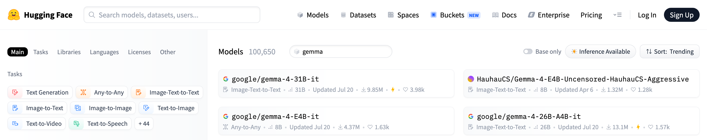

+++

title = "[AgI] LLM-as-a-Service"
description = "Background about using LLMs via Service Providers"
outputs = ["Reveal"]

+++

# Using LLMs via Service Providers

{}

---

## Outline

### Key engineering aspects of LLM-as-a-Service

0. **On-premise** vs. **On-cloud** deployment
    - On-premise: the model is hosted and run on the _user's own infrastructure_, commonly via _containerized solutions_ (e.g. [Ollama](https://ollama.com/), [Docker's Model Runner](https://www.docker.com/products/model-runner/), etc.)
        + implies ad-hoc _hardware requirements_ (e.g. Nvidia GPUs, Apple Silicon) and technical expertise for setup and maintenance
        + the service provider is commonly the company providing the _containerized solution_, and making _models_ available for _download_ and use
        + most commonly, containerized solutions provide the same _API_ as the on-cloud service, to facilitate migration between the two deployment options
    - On-cloud: the model is hosted and run on the _service provider's infrastructure_, and accessed via _API calls_
        + implies _<u>no</u> hardware requirements_ for the user, but a _cost per usage_ (e.g. per token, per request, etc.)

1. **Service Provider**: several exist, with different offerings in terms of models, pricing, and features
    - e.g. [OpenAI](https://openai.com/), [Anthropic](https://www.anthropic.com/), [Google](https://cloud.google.com/vertex-ai), [Microsoft](https://azure.microsoft.com/en-us/services/cognitive-services/), [Hugging Face](https://huggingface.co/inference-api), or aggregators like [OpenRouter](https://openrouter.ai/)
    - the choice of the service provider can depend on several factors, including:
        + the availability of _specific models_ (e.g. GPT, Claude, Gemini, etc.) in their __model zoos__
        + the _pricing model_ and cost structure
        + the _features_ and _capabilities_ offered (e.g. fine-tuning, custom models, MCP support, etc.)

1. **Web API Compatibility**: early providers (e.g. OpenAI, Google) invented _their own APIs_, similar in the spirit, but _different in syntax_
    - some later providers attempted to adopt the _same API_ as the _market leader_ (OpenAI), to facilitate adoption
        * others (e.g. HuggingFace) come with their own API, which may be more or less compatible with OpenAI's API
    - API compatibility is key for _provider interchangeability_, hence allowing migration and __avoiding vendor lock-in__

1. **Client Libraries**, in target _programming languages_ wrap Web API clients and make it easier to use _LLMs programmaticatically_
    - here you may care about which programming languages (e.g. Python, JS, Java, etc.) are supported by some given client library...
        * most commonly, the same provider implements the same meta-model onto different target programming languages (e.g. OpenAI' client is available in Python, JS, Java, etc.)
    - there exist also _third-party_ client libraries, which may support multiple Web APIs, and therefore multiple providers (e.g. [LangChain](https://docs.langchain.com/oss/python/langchain/overview))

---

{}



# Model Zoos

---

## Model zoos (pt. 1): the general concept

- A __model zoo__ (a.k.a. model _hub_, _catalog_, _library_) is a _searchable collection_ of models made available by some provider, each one with:
    + a __name__ (and _versions_/_variants_), to be used in API calls or downloads
    + a __model card__: a document describing the model's _purpose_, _training data_, _evaluation_ results, _limitations_, and _intended uses_ (cf. [Mitchell et al., 2019](https://arxiv.org/abs/1810.03993))
    + _technical metadata_: size, _context window_, supported _modalities_ (text, image, audio), support for _tools_ / _structured output_ / _reasoning_
    + _economic_ and _legal_ metadata: price per token (for on-cloud zoos), __license__ (for downloadable models)

- Zoos are the _entry point_ for __model selection__, which is a recurring activity in GenAI engineering (cf. [GenAI workflow](../genai/#/genai-workflow))

<!--  -->

### Example

- [Hugging Face Hub](https://huggingface.co/models) is a model zoo with millions of models for any task and any modality,
    - each one with a model card, technical metadata, and license information
    - e.g. filter on "Gemma" to see the [Gemma family](https://huggingface.co/models?sort=trending&search=gemma) of LLMs, then click on one to see the card

    

---

## Model zoos (pt. 2): the technological landscape

| | [Hugging Face Hub](https://huggingface.co/models) | [Ollama library](https://ollama.com/models) | [Open Router](https://openrouter.ai/models) |
|---|---|---|---|
| __Kind__ | download (+ some hosted inference) | download, run locally | on-cloud, pay per token |
| __Size__ | millions of models (any task, any modality) | hundreds of curated LLMs | hundreds of LLMs from dozens of providers |
| __Naming__ | `organization/model-name` | `model:variant` (e.g. `gemma4:e2b`) | `provider/model[:tier]` (e.g. `google/gemma-4-26b-a4b-it:free`) |
| __Variants__ | separate repositories (e.g. `...-GGUF`, `...-AWQ`) | _tags_ for size and quantization | one entry per model, served by several providers |
| __Metadata__ | full model card, files, license, community | size, context, capabilities, quantization | price, context, latency/throughput stats, supported parameters |
| __License__ | per model (shown as a tag) | per model (in the model page) | provider's _terms of service_ apply |

### Recurring naming conventions (worth decoding)

- _family_ + _version_: `llama-3.1`, `qwen3`, `gemma-4`
- _size_: `8b`, `70b`, or `26b-a4b` (MoE: total vs. active parameters)
- _flavour_: `base` (pure next-token predictor) vs. `instruct` / `it` / `chat` (tuned to follow instructions: __this is what you want__ for Chat Completion), or `coder`, `vl` / `vision`, `thinking`
- _quantization_ / _format_: `Q4_K_M`, `GGUF`, `AWQ`, `fp8`
- _date_ / _snapshot_: `gpt-4o-2024-08-06` (pin it for _reproducibility_!)

---

## Model zoos (pt. 3): what next?

- Zoos tell you _which_ models exist, and what they _claim_ to be capable of
- __Choosing__ the right model for a given task, and __evaluating__ it on _evidence_, are decisions with consequences on quality, cost, control, and compliance
    + hence, they are discussed in the [AI Governance lecture](../governance/#/model-selection), along with an exercise on comparing models on the running example

{}

---

# On-premise deployment

Reference technology: [Ollama](https://ollama.com/)

---

{}



## About Ollama (cf. <https://ollama.com/>)

- Ollama is a company that provides a _containerized_ solution for _hosting_ and _running_ LLMs __on-premise__, with a focus on ease of use and accessibility

- It offers a [model zoo](https://ollama.com/models) with several pre-trained models available for _download_ and use
    + plus a _native API_ that is _partially compatible_ with OpenAI's API, to facilitate migration between on-premise and on-cloud deployments

- Ollama's solutions can be used on various __hardware__ & __OS configurations__, including _Nvidia_ GPUs and _Apple Silicon_ as well as _Linux_, _MacOS_, and _Windows_

- Ollama's API supports both a native __CLI conversational interface__ and a __Web API__ for programmatic access, making it versatile for different use cases and user preferences

- Ollama may also be used an [on-cloud service](https://ollama.com/pricing), but here we will focus on the on-premise deployment option alone
    + three levels of premiumships (0€/month, 20€/month, 100€/month) with widening rate limitations

---

## On-premise Example with Ollama pt. 1

0. Ensure you have the __required hardware__ (e.g. Nvidia GPU, Apple Silicon, etc.)
    + details and configuration caveats: <https://docs.ollama.com/gpu>
    + how to tell whether a model _fits_ your machine: see [Running models locally](#/local-requirements) below

1. __Install__ Ollama on your machine:

    ```bash
    brew install ollama # For macOS (Apple Silicon)
    curl -fsSL https://ollama.com/install.sh | sh # For Linux
    irm https://ollama.com/install.ps1 | iex # For Windows (PowerShell)
    ```

2. Activate the Ollama __service__ in some shell (alternatively, configure a _deamon_ to run it in background):

    ```bash
    ollama serve
    ```

---

## On-premise Example with Ollama pt. 2

3. Have a look to Ollama's __model zoo__ on <https://ollama.com/models>, and __select__ some model you like among the many variants available
    * notice naming convention: `model:variant`, most commonly the variant denotes the size of the model

    
    

---

## On-premise Example with Ollama pt. 3

4. Pick one model, e.g. `gemma4:e2b`, and __pull__ it:

    ```bash
    ollama pull gemma4:e2b
    ```

5. You may use Ollama's native __CLI conversational interface__ to try the model out:

    ```bash
    ollama chat gemma4:e2b
    ```

    example of conversation (notice that the model is also showing its _thinking process_):

    ```text
    >>> ciao!
    Thinking...
    Thinking Process:

    1.  **Analyze the input:** The input is "ciao!". This is an informal Italian greeting, meaning "hello!".
    2.  **Determine the appropriate response:** Since the user initiated a friendly greeting, the response
    should also be a greeting, ideally reciprocating the language or offering a friendly follow-up.
    3.  **Formulate the response (in Italian):** The simplest and most common reply is "ciao" (hello/hi) or
    a slightly expanded version.
    4.  **Add a standard conversational element (optional but good practice):** Asking how the user is doing
    is polite. ("Come stai?" / "Come va?")
    5.  **Final selection:** A friendly, standard reply.

    *Self-Correction/Refinement:* Keep it warm and open-ended.

    *Output Generation:* Ciao! Come stai? (Hello! How are you?)
    ...done thinking.

    Ciao! Come stai? 😊
    ```

---

## On-premise Example with Ollama pt. 4

6. Should you ever want to use the model _programmatically_, you can use Ollama's __API__, which is _partially_ compatible with OpenAI's API
    * e.g. it supports the same `/v1/chat/completions` endpoint, but not all the features of OpenAI's API, e.g. fine-tuning, custom models, etc.
    * in the client program, recall to set the __API base URL__ to point to your local Ollama service (by default: <http://localhost:11434>)
    * to prove that the API is working, you can send a test request via `curl`:

        ```bash
        curl -X POST "http://localhost:11434/v1/chat/completions" \
            -H "Content-Type: application/json" \
            -d '{
                "model": "gemma4:e2b",
                "messages": [
                    {"role": "system", "content": "You are a helpful assistant."},
                    {"role": "user", "content": "What is the capital of France?"}
                ]
            }'
        ```

        result (converted in YAML for the sake of readability):

        ```yaml
        id: chatcmpl-85
        object: chat.completion
        created: 1779435598
        model: gemma4:e2b
        system_fingerprint: fp_ollama
        choices:
        - index: 0
            message:
            role: assistant
            content: The capital of France is **Paris**.
            reasoning: |-
                Thinking Process:

                1.  **Analyze the Request:** The user is asking a factual question: "What is the capital of France?"
                2.  **Identify the Knowledge Needed:** I need to retrieve the capital city of France.
                3.  **Recall/Retrieve the Fact:** The capital of France is Paris.
                4.  **Formulate the Answer:** Provide a direct and accurate answer.
                5.  **Final Review:** The answer is correct and directly addresses the query. (Capital of France = Paris).
            finish_reason: stop
        usage:
        prompt_tokens: 29
        completion_tokens: 121
        total_tokens: 150
        ```

{}

---

{}



## Running models locally: what does it take? (pt. 1)

### The general concept: a model is a (huge) array of numbers

- An LLM is essentially a collection of __parameters__ (a.k.a. _weights_), i.e. numbers learned during training
    + model _size_ is expressed in number of parameters: e.g. `7B` = 7 billion parameters, `70B` = 70 billion
- To __run__ a model (_inference_), all its weights must be loaded in the _memory_ of the device doing the computation
    + ideally, the GPU's memory (__VRAM__), as GPUs are much faster than CPUs at the matrix multiplications LLMs are made of
- Hence, the __memory footprint__ of a model is roughly:

> __memory__ ≈ (number of params × bits per param / 8) [_weights_] + _KV cache_ [grows with context length] + _overhead_

- the __key-value (KV) cache__ stores the attention values for the tokens (keys) that the neural has processes so far...
    + ... so that they do not need to be recomputed for every new token generated
    + its size _grows linearly_ with the _context length_
        + this is why local runtimes (e.g. Ollama) use a _smaller_ default context window than the model's maximum
- the _overhead_ covers runtime buffers, activations, and driver context: usually an extra ~10–20%



---

## Running models locally: what does it take? (pt. 2)

### Rule of thumb for the weights alone

| Model size | 32-bit (`fp32`) | 16-bit (`fp16`/`bf16`) | 8-bit (`int8`, `Q8_0`) | ~4-bit (`Q4_K_M`) |
|-----------:|----------------:|-----------------------:|-----------------------:|------------------:|
| 1B  | 4 GB   | 2 GB   | ~1 GB  | ~0.6 GB |
| 7B  | 28 GB  | 14 GB  | ~7.5 GB | ~4.3 GB |
| 14B | 56 GB  | 28 GB  | ~15 GB | ~8.6 GB |
| 32B | 128 GB | 64 GB  | ~34 GB | ~20 GB  |
| 70B | 280 GB | 140 GB | ~74 GB | ~43 GB  |

- i.e. GB ≈ billions of params × bits per weight / 8 (`Q8_0` ≈ 8.5 bits, `Q4_K_M` ≈ 4.9 bits, cf. [llama.cpp's quantize docs](https://github.com/ggml-org/llama.cpp/blob/master/tools/quantize/README.md))
- add ~10–30% on top for the KV cache and the runtime (more for long contexts)
- models are _trained_ in 16/32 bits, but most local users run them at __8 or 4 bits__: this is called _quantization_

{}
> Before pulling a model, __do the math__: if it does not fit in VRAM, it will either _fail_ to load, or be (partially) _offloaded_ to the CPU, becoming _much slower_
{}

---

## Quantization (pt. 1): the concept

- __Quantization__ = representing the model's weights with _fewer bits_ (e.g. 4-bit integers instead of 16-bit floats)
    + by mapping _ranges_ of real values onto a small set of _discrete levels_, plus some _scaling factors_ (stored per _block_ of weights)
- Why?
    + _less memory_ $\implies$ bigger models on the same hardware
    + _faster_ inference, as moving weights around in memory is the main bottleneck
- At what price?
    + _loss of precision_ $\implies$ some _quality degradation_, which is often negligible at 8 bits, noticeable at 4 bits, and severe below 3 bits
    + degradation is task-dependent (e.g. worse for maths, code, and non-English languages)



---

## Quantization (pt. 2): the technological landscape

Several _quantization methods_ and _file formats_ exist, bound to specific __runtimes__:

| Format / method | Typical runtime | Notes |
|-----------------|-----------------|-------|
| [GGUF](https://huggingface.co/docs/hub/gguf) | [llama.cpp](https://github.com/ggml-org/llama.cpp), Ollama, LM Studio | single file with weights + metadata; runs on CPU, GPU, Apple Silicon; many quant _levels_ |
| [GPTQ](https://arxiv.org/abs/2210.17323) | vLLM, Hugging Face Transformers | post-training quantization calibrated on sample data; GPU-oriented |
| [AWQ](https://arxiv.org/abs/2306.00978) | vLLM, Hugging Face Transformers | preserves the most "salient" weights; GPU-oriented |
| [bitsandbytes](https://github.com/bitsandbytes-foundation/bitsandbytes) ([LLM.int8()](https://arxiv.org/abs/2208.07339)) | Hugging Face Transformers | quantizes _on the fly_ when loading; used for fine-tuning too |
| [MLX](https://github.com/ml-explore/mlx) | MLX, LM Studio | Apple Silicon only |

---

## Decoding GGUF quantization labels (as seen in Ollama's tags)

- `F16` / `BF16`: no quantization (16-bit)
- `Q8_0`: 8-bit (~8.5 bits per weight, including block scales), nearly lossless
- `Q4_K_M`: ~4.9 bits per weight on average
    - `K` = _k-quants_ (super-blocks of weights whose sub-block scales are quantized too)
    - `M`edium mix (a few sensitive tensors kept at higher precision): the usual __default__ trade-off
- `Q2_K`, `Q3_K_S`, ... : smaller and increasingly lossy (`S`mall, `M`edium, `L`arge mixes)
- `IQ*`: _importance-matrix_ quants, calibrated on sample text to lose less at very low bit-widths

e.g. `ollama pull gemma4:e2b` downloads the default quantization, whereas tags like `...-q8_0` or `...-fp16` select a specific one (see the _"Tags"_ tab of each model on [Ollama's zoo](https://ollama.com/models))

---

## Running models locally: hardware & software (pt. 1)

### Hardware

- __Nvidia GPUs__ (CUDA): the reference platform; the VRAM size is what matters most (e.g. 8, 12, 16, 24 GB for consumer cards; 40–80+ GB for data-center ones)
- __AMD GPUs__ (ROCm): supported, with fewer models of cards and more caveats
- __Apple Silicon__ (Metal): CPU and GPU share a _unified memory_, so the whole RAM (minus what the OS needs) is usable by the model
- __CPU only__: works for small models, but expect _few tokens per second_
- __Partial offloading__: layers that do not fit in VRAM run on the CPU, which works but is much slower

(cf. <https://docs.ollama.com/gpu> for the supported GPUs)

### Mixture-of-Experts (MoE) models

- Some models activate only a _subset_ of their parameters for each token
    + e.g. `gemma-4-26b-a4b-it` = 26B _total_ parameters, ~4B _active_ per token
- __Memory__ depends on the _total_ parameters (all experts must be loaded), __speed__ depends on the _active_ ones

---

## Running models locally: hardware & software (pt. 2)

### What fits where? (indicative, at ~4-bit quantization, moderate context)

| Machine | Comfortable model size |
|---------|-----------------------|
| laptop, 8 GB RAM, no GPU | ≤ 3B (slow) |
| laptop, 16 GB unified memory (Apple Silicon) | ≤ 8B |
| desktop, 12–16 GB VRAM GPU | ≤ 14B |
| workstation, 24 GB VRAM GPU (or 32–64 GB unified memory) | ≤ 32B |
| server, 2× 80 GB GPUs | ≤ 70B at 8-bit, larger with 4-bit or MoE |

### Software

- up-to-date __GPU drivers__ (CUDA for Nvidia, ROCm for AMD; Metal is built into macOS)
- a __runtime__: [Ollama](https://ollama.com) (simplest), [LM Studio](https://lmstudio.ai/) (GUI), [llama.cpp](https://github.com/ggml-org/llama.cpp) (lowest level), [vLLM](https://docs.vllm.ai/) (server-grade, high throughput, many concurrent users)
    + all of them expose an _OpenAI-compatible_ Web API, so client code does not change
- check what is running, and _where_, with `ollama ps` (illustrative output):

    ```text
    NAME          ID              SIZE      PROCESSOR    CONTEXT    UNTIL
    gemma4:e2b    a1b2c3d4e5f6    7.2 GB    100% GPU     4096       4 minutes from now
    ```

    + `PROCESSOR` tells whether the model is fully on the GPU, or split between CPU and GPU (e.g. `48%/52% CPU/GPU`)

{}

---

# On-cloud deployment with Open Router

(Reference technology: [Open Router](https://openrouter.ai/))

---


{}



## About Open Router (cf. <https://openrouter.ai/>), pt. 1

- Open Router (_OR_) is a company that provides an __on-cloud__ service for using _LLMs as services_, with a focus on _provider interchangeability_

- Its distinguishing feature is that it acts as an _aggregator_ of multiple service providers, allowing users to access a variety of models from different providers via a single API, and helping to avoid vendor lock-in
    + one can use OR for __free__, with _very limited rates_ (20 requests per minute, max 50 per day)
        * one may __buy credits__ to widen the limitations for free models (see <https://openrouter.ai/docs/api/reference/limits> for details), or to use _pay-per-use_ models

- Pretty rich [model zoo](https://openrouter.ai/models), exposing models from <u>many</u> different providers, most notably: OpenAI, Anthropic, Google, xAI, Mistral, etc.
    + notice that models come with __price-per-token__, commonly expressed a `$/1M tokens` (some times the prices is different for _input_ or _output_ tokens)
        * this is very common for on-cloud services, and it is the main reason why we need to be careful when experimenting with them, to avoid unexpected costs
        * recall that _token_ $\neq$ _word_ (cf. [tokens](../genai/#/tokens))

    

---

## About Open Router (cf. <https://openrouter.ai/>), pt. 2

- Models in OR's zoo are __named__ according to the following convention: `provider/model` followed by _optional_ `:tier`, where:
    + `provider` is the name of the service provider (e.g. `openai`, `qwen`, `google`, etc.)
    + `model` is the name of the model _variant_ as provided by the provider (e.g. `gpt-oss-120b`, `qwen3-coder`, `gemma-4-26b-a4b-it`, etc.)
    + `tier` is an optional suffix that denotes a specific variant of the model (most commonly `free` for free models)


- To allow for __dynamic routing__ of requests to different providers in a _transparent_ way, OR allows for the following meta-models:
    + `openrouter/auto` ([AutoRouter](https://openrouter.ai/openrouter/auto)): let OR decide which provider/model to use for each request, based on the request's content and the current availability of models (__paid__: it may route to paid models, so it fails on accounts without credits)
    + `provider/*` (e.g. `anthropic/*`, `google/*`, etc.): OR will serve each request with the best available model from the specified provider, according to the request's content and the current availability of models
    + in general, you can reason like with Unix globs, so for instance `openai/gpt*` will match any OpenAI model whose name starts with `gpt` (as currently provided by OR)
    + in the [routing settings](https://openrouter.ai/workspaces/default/routing) of your OR account, you can set up the __routing strategy__ OR should adopt:
        1. __"Price"__ (cost-first): OR will route requests to the currently _cheapest_ model that can serve them
        2. __"Latency"__: OR will route requests to the model that is _currently quicker_ to respond
        3. __"Throughput"__: OR will route requests to the one that has currently the best stats in terms of _throughput_ (requests per minute)
        4. __"Exacto"__ (quality-first): OR will route requests to the _best available_ model that can serve them (based on model's stats on tools usage)

- __Bring your own API key__ (BYOK): OR allows you to _link_ your account with your API keys from _other providers_ so that you can use OR's API to access models from those providers, and therefore be charged according to the prices of those providers instead of OR's prices
    + this is a great feature to avoid vendor lock-in, and to have more control over the costs and the models you want to use

> Dynamic routing and BYOK are _peculiar_ features of OR, for the rest it's an "ordinary" on-cloud provider

---

## On-cloud Example with Open Router (pt. 1)

1. __Sign up__ & _log in_ for an account on Open Router: <https://openrouter.ai>
    + easier to re-use your GitHub account

2. Optionally add __payment methods__ and _credits_ to your account in <https://openrouter.ai/settings/credits>
    + no credit needed for this lecture
    + recall to set _expense limitation_ to avoid unexpected costs, in case you decide to experiment with actual money

    

---

## On-cloud Example with Open Router (pt. 2)

3. From time to time, keep an eye on the __activity dashboard__ of your account, to check the usage and the costs of your requests: <https://openrouter.ai/activity>

    

---

## On-cloud Example with Open Router (pt. 3)

4. To use OR's models programmatically, you need to create an __API key__ first (to be stored securely, and not shared with anyone else)
    * (i.e. an _authentication token_ to let clients authenticate on your behalf)
    * you can do that for the _default workspace_ at <https://openrouter.ai/workspaces/default/keys>
        + __workspaces__ are OR-wise _administration domains_, inside which configurations rules (e.g. routing rules, cost limits, etc.) apply

    

    + an API key is a string of the form: `sk-or-XXXXXXXXXXXXXXXXXXXXXXXX`: it is sufficient to <u>consume your credit</u> and to make requests on your behalf

---

## On-cloud Example with Open Router (pt. 4)

5. You may test your API key with a simple `curl` request:

    ```bash
    curl -X POST "https://openrouter.ai/api/v1/chat/completions" \
        -H "Content-Type: application/json" \
        -H "Authorization: Bearer YOUR_API_KEY" \
        -d '{"model": "nvidia/nemotron-3-super-120b-a12b:free", "messages": [{"role": "user", "content": "What is the capital of France?"}]}'
    ```

---

## On-cloud Example with Open Router (pt. 4, cont.)

answer (converted in YAML for the sake of readability):

```yaml {class="print-2cols"}
id: gen-1779447979-077vepCYJjlgJfXKnK2q
object: chat.completion
created: 1779447979
model: openai/gpt-5-nano-2025-08-07
provider: OpenAI
system_fingerprint: null
service_tier: default
choices:
  - index: 0
    logprobs: null
    finish_reason: stop
    native_finish_reason: completed
    message:
      role: assistant
      content: Paris.
      refusal: null
      reasoning: '**Providing the capital of France**


        The user asked a straightforward question: "What is the capital of France?"
        The answer is simple: Paris. I should respond concisely. My best guess is
        to confirm: "The capital of France is Paris." While adding context could be
        fun, it’s not necessary since the user didn’t request it. If I wanted to be
        helpful, I could mention that Paris is the largest city and home to famous
        landmarks like the Eiffel Tower, but I’ll keep it brief.**Confirming details
        on Paris**


        I can keep my response short and straightforward. The user asked about the
        capital of France, and I can simply say: "Paris." If I want to offer more,
        I could say, "The capital of France is Paris." I think that covers it! But
        if they are interested, I could mention I''m happy to share more details about
        Paris if they''d like. For now, I’ll stick with the essential answer.'
usage:
  prompt_tokens: 13
  completion_tokens: 243
  total_tokens: 256
  cost: 9.785e-05
  is_byok: false
  prompt_tokens_details:
    cached_tokens: 0
    cache_write_tokens: 0
    audio_tokens: 0
    video_tokens: 0
  cost_details:
    upstream_inference_cost: 9.785e-05
    upstream_inference_prompt_cost: 6.5e-07
    upstream_inference_completions_cost: 9.72e-05
  completion_tokens_details:
    reasoning_tokens: 192
    image_tokens: 0
    audio_tokens: 0

```

{}

---

# APIs for LLMs

---

{}



## The general concept: _Chat Completion_ as a request–response API

- Regardless of the provider, programmatic access to an LLM follows the same _request–response_ scheme (HTTP + JSON):
    1. the __client__ (your program) sends a __request__ containing
        * the _name_ of the model to be used
        * the _conversation_ so far, as an ordered list of __messages__, each with a _role_ (`system`, `user`, `assistant`, `tool`) and some _content_
        * optional _generation parameters_ (e.g. temperature, max tokens, output format, available tools)
    2. the __server__ (the provider) lets the model generate the _next message_ of the conversation
    3. the server sends a __response__ containing the generated message, plus _metadata_ (e.g. token usage, finish reason)
- The model is __stateless__: it does _not_ remember previous requests
    + to have a _conversation_, the __client__ keeps the history, and re-sends it _all_ at each request (appending the model's answers to it)
    + hence, the cost and latency of each request _grow_ with the conversation length (every request re-processes all tokens)
- A _chat_ is just the special case where the next message is shown to a human, and the human's reply is appended to the history

---

## Chat Completion: an intuitive example


@startuml
hide footbox
actor "User" as U
participant "Program (client)" as P
participant "LLM provider (server)" as L
note over P: history = [system: "be friendly"]
U -> P: "hi, what time is it?"
note over P: history += [user: "hi, what time is it?"]
P -> L: POST /chat/completions {model, messages: [system, user]}
L --> P: {choices: [{message: {assistant: "I have no clock, where are you?"}}], usage: {...}}
note over P: history += [assistant: "I have no clock, ..."]
P -> U: "I have no clock, where are you?"
U -> P: "Cesena, Italy"
note over P: history += [user: "Cesena, Italy"]
P -> L: POST /chat/completions {model, messages: [system, user, assistant, user]}
note over L: keeps nothing between requests: the WHOLE history is re-sent
L --> P: {choices: [{message: {assistant: "It's ... in Cesena"}}], usage: {...}}
P -> U: "It's ... in Cesena"
@enduml


- Notice that the __same__ interaction is implemented by _all_ providers, only the _syntax_ changes
    * endpoint names, field names, where the system prompt goes, etc.

---

## What to expect in general from Web APIs of LLM-as-a-Service providers?

1. __Pick__ among a variety of __models__ (by _name_), with different features, capabilities (and prices)

2. __Provide__ general __instructions__ for the task at hand (e.g. via _system prompts_, or top-level instructions)

3. __Ask__ the __next message__ to produce after a _sequence of messages_ (e.g. via chat completions)
    - input/output messages may include content of _different modalities_ (e.g. text, images, audio, video, files, etc.)
    - messages may also include _tool calls_, _tool results_, _reasoning traces_, etc.
    - input messages may contain instructions about how to _structure the output_ (e.g. via JSON schema, or other constraints)

4. Message __streaming__: receive partial responses as they are generated by the model, instead of waiting for the full response

5. Include __tools descriptions__ somewhere, so that model can ask the outer system to _call_ (a.k.a. _invoke_) them when needed
    - outer system is supposed to react to tool invocation with _tool results_, which are then fed back to the model as part of the conversation
        + so that the model can decide how to use them to complete the task at hand

6. Set the __temperature__ of the model, to control the randomness of the output
    + e.g. higher temperature means more random output, while lower temperature means more deterministic output

---

## About LLMs' Web API Compatibility (pt. 1) – OpenAI family

* **Shape**: _"Chat Completions"_ uses `/chat/completions` end point; _"Responses"_ uses `/responses` endpoint
* **Abstraction**: Chat is role-message based; Responses is typed-item based
    - e.g. chat can be a content (e.g. text, image), provided by a role (e.g. user, assistant); responses can be a tool call, a tool result, a reasoning step, etc.
    - e.g. responses could be messages, or tool call or results
* **Capabilities**:
    - _calling tools_ (implies including tool definitions in the prompt, so that the model can call them)
    - _structured_ output (e.g. constrain model response to match a given JSON schema)
    - _multimodal_ (e.g. include images, audio, video in the prompt and/or response)
    - _streaming_ (e.g. receive partial responses as they are generated by the model, instead of waiting for the full response)
    - _reasoning traces_ (e.g. receive the model's reasoning process as part of the response, to understand how it arrived at its answer)
* **Peculiarities**: "Responses" is more modern; "Chat Completions" is more compatible
* **Portability**: "Chat Completions" is high; "Responses" is mostly OpenAI/Azure-native

---

## About LLMs' Web API Compatibility (pt. 2) – OpenAI-compatible APIs

* **Shape**: mimic `/v1/chat/completions`, `/v1/completions`, `/v1/embeddings`
* **Abstraction**: OpenAI-like messages over non-OpenAI models
  - Example: same SDK call, different `base_url`, `api_key`, and `model`
* **Capabilities**: usually chat and streaming; tools/JSON vary substantially
  - Example: text streaming may work, but tool-call parsing may fail or differ
* **Peculiarities**: compatibility is often only wire-level, not behavioral
* **Portability**: good for client reuse; weak for advanced features exploitation

{}
> It may happen that some providers (e.g. Ollama) offer an OpenAI-compatible API, but with a subset of the features of OpenAI's API, and with some differences in the behavior of the models (e.g. in terms of tool use, reasoning traces, etc.)

when this is the case, the client will fail at run-time, complaining about unsupported features for non-reachable endopoint!
{}

---

## About LLMs' Web API Compatibility (pt. 3) – Anthropic Claude API

* **Shape**: `/v1/messages`
* **Abstraction**: messages plus content blocks and top-level system instruction
  - Example: `system: "..."` separate from `messages: [...]`
* **Capabilities**: tool use, streaming, long context, prompt caching, extended thinking
  - Example: cache a long policy document, then ask many follow-up questions
* **Peculiarities**: system prompts, tool results, and streaming events differ from OpenAI
* **Portability**: strong native API; needs adapter for OpenAI-style systems

---

## About LLMs' Web API Compatibility (pt. 4) – Google API

* **Shape**: `generateContent` and `streamGenerateContent`
* **Abstraction**: `contents` made of multimodal `parts`
  - Example: one request can include `text`, `image`, `audio`, or `file` parts
* **Capabilities**: native text, image, audio, video, files, tools, structured output
  - Example: analyze a PDF/image, call a function, return schema-constrained JSON
* **Peculiarities**: multimodality is core, not an add-on to chat
* **Portability**: powerful native API; structurally different from OpenAI/Anthropic

---

## About LLMs' Web API Compatibility (pt. 5) – Cloud-provider APIs

* **Shape**: AWS Bedrock Converse; Azure OpenAI / Azure AI Foundry APIs
* **Abstraction**: provider-managed access to multiple or deployed models
  - Example: Azure calls a deployment name; Bedrock calls a model via AWS runtime
* **Capabilities**: streaming, tools, structured output, governance features
  - Example: IAM-controlled access, content filters, guardrails, regional deployment
* **Peculiarities**: deployment names, API versions, regions, IAM, filters leak into design
* **Portability**: good inside the cloud ecosystem; weaker across ecosystems

---

## About LLMs' Web API Compatibility (pt. 6) – Gateways and routers

* **Shape**: usually OpenAI-compatible proxy APIs
* **Abstraction**: one internal API over many upstream providers
* **Capabilities**: routing, fallback, retries, budgets, logging, observability
* **Peculiarities**: advanced features leak through provider-specific behavior
* **Portability**: strong for application architecture; imperfect for feature exploitation

---

## About LLMs' Web API Compatibility (pt. 7) – Wrap Up

__OpenAI-like__ APIs are becoming the _de-facto_ standard, yet they are currently under active _evolution_



{}

---

# Client-side libraries for LLMs

Reference technologies: [OpenAI Client Libraries](https://developers.openai.com/api/docs/libraries), [LangChain](https://docs.langchain.com/oss/python/langchain/overview)

---

## About client libraries

- Main providers – especially the ones exposing their own Web APIs – come with their own __client libraries__
    + wrapping those APIs into custom SDKs for target programming languages (e.g. Python, JS, Java, etc.)

- Two major didactical choices here (among the _many_ possible ones):
    1. [OpenAI Client lib](https://developers.openai.com/api/docs/libraries) flavoured for JavaScript, Python, .Net, Java, Go, Ruby, CLI
        + it is the "reference" client, since OpenAI invented the first Web API for LLMs, and many other providers mimicked it
    2. [LangChain](https://docs.langchain.com/oss/python/langchain/overview) flavoured for Python and JavaScript
        + it is a _third-party_ client library, which supports [multiple providers](https://docs.langchain.com/oss/python/integrations/providers/overview) and APIs (e.g. OpenAI, Anthropic, Google, Azure, etc.)
        + it is more focused on _orchestrating_ interactions with LLMs and tools, rather than just wrapping Web APIs

---

## OpenAI's Chat Completion API with Python

- This is the simplest and most common way to interact with OpenAI-like API providers, via the [openai-python](https://github.com/openai/openai-python) library
    * just run `pip install openai` to install it, into your (virtual) Python environment
    * in your Python scripts, just import the `openai` module

- API comes with _synchronous_ and _asynchronous_ variants
    * __synchronous__: the model's _response_ is returned as a _whole_, after the model has finished generating it (which may take _time_)
    * __asynchronous__: the model's _response_ is returned as a _stream_ of parts, as they are generated by the model, allowing for a more fluid experience (content shown _ASAP_)

- In both cases, ingredients are essentially the same:
    1. __Env vars__ (or command line arguments): to parametrize your program w.r.t. _API keys_, API providers' _base urls_, _model names_, etc.
    2. __Client__: an object of type `openai.OpenAI` (for _sync_) or `openai.AsyncClient` (for _async_) by which you interact with a model as provided by some provider
        - documented "by example" at <https://github.com/openai/openai-python/blob/main/README.md>
    3. __Conversation history__: literally a _list_ of _dictionaries_, each one having two keys: `role` (e.g. "system", "user", "assistant") and `content` (actual text)
    4. __Chat completion request__: a call to the `client.chat.completions.create()` method, accepting the conversation hystory as input plus some additional parameters (e.g. `temperature`, `max_tokens`, etc.) and returing either the full response (sync) or a stream of response parts (async), depending the parameter `stream` (respectively `False` or `True`)
        + documented here <https://developers.openai.com/api/reference/resources/chat/subresources/completions/methods/create>
    5. __Chat completion response__: a dictionary containing the model's response, including the generated content (e.g. in `.choices[0].message.content`), plus some additional metadata (e.g. `usage`, `model`, etc.)
        + in principle, there could be multiple _choices_ in the response (in practice is often just one): the idea is that the model may produce alternative responses at once
        + documented here <https://developers.openai.com/api/reference/resources/chat/subresources/completions/methods/retrieve>
    6. The __agent__, i.e. the program exploiting the aformentioned functionalities to accomplish some task
        + in case multiple subsequent request–response interactions are needed, the agent should include also reponses' messages in the chat history
        + this is because the model is _stateless_, and the HTTP API are _ReSTful_, but the "conversation" is _mutable_ entity

---

{}

## Example 1: Sync CLI Chat (pt. 1)

1. Let's first create the client out of OR's base URL, API key, and target model:

    {}

    notice that:
    - class `OpenAI(...)` initializes the client in a very customizable way
    - the `base_url` parameter, which commonly defaults to <https://api.openai.com/v1>, is set to OR's base URL <https://openrouter.ai/api/v1>, unless specified otherwise via env vars
    - the `api_key` is not in the source file, but taken from env var, or stdin (via `input(...)`), to avoid hardcoding it in the source code
    - the `model` (passed later, in each request) must be set to some model available in the provider's model zoo
    - env vars `OPENAI_BASE_URL`, `OPENAI_API_KEY`, `OPENAI_MODEL` are read via `os.environ.get(NAME, DEFAULT)` (all optional)

2. Let's then _initialize_ the _conversation_ history with a __system prompt__, containing _general instructions_ for the LLM, which make sense w.r.t. the task at hand

    {}

    here one may give additional instructions to be followed in the rest of the conversation

    - e.g. "always answer in english", or "detect the user's langauge and answer in the same language", etc.

---

## Example 1: Sync CLI Chat (pt. 2)

3. Finally, we can enter a loop in which we read the user's input from the command line, send it to the model as a new message in the conversation, and print the model's response back to the command line

    {}

    notice that:

    1. external `try-except` block is used to catch user's `KeyboardInterrupt` (e.g. Ctrl+C) or `EOFError` (e.g. Ctrl+D) to exit gracefully from the loop
    1. user input is first looked for _sub-commands_ (e.g. `/exit`, `/retry`, etc.)
        + `/retry` adds _no_ new message, so the same history is re-sent, possibly getting a _different_ answer
    1. _non_-sub-command _input_ is then used to create a new message with role `user`, which is appended to the conversation history (`messages` list)
    1. then, a chat completion _request_ is sent to the `model` via `client.chat.completions.create(...)`, with the conversation history as input
    1. the model's _response_ is supposed to contain a _single choice_ (`response.choices[0]`), whose `.message.content` is what we show to the user
        + `content` may be `None` (e.g. on tool calls), hence the `or ""`

---

## Example 1: Sync CLI Chat (pt. 3)

4. Full code [here](../lab-snippets/snippets/lecture_llmaas/example1/repl_chat_openai.py)

5. Example of interaction with the model (start with `poetry run python -m snippets -l llmaas -e 1`, cf. [how to run snippets](../#/lab-snippets-run)):

```text
Enter your API key for https://openrouter.ai/api/v1/: sk-or-v1-XXXXXXXXXXXXXXXXXXXXXXXXX
Using model: nvidia/nemotron-3-super-120b-a12b:free
Type '/exit' or '/quit' to stop. Type '/retry' to retry the last message.

you> hi there, what time is it?

assistant> Hi! I don’t have a real-time clock on my end. Could you tell me your time zone or city, and I’ll give you the current local time? If you’d prefer, I can also give you the current UTC time.

you> it's Cesena, in Italy

assistant> In Cesena, Italy right now it’s Central European Summer Time (CEST), which is UTC+2. I can’t see the exact current time here, but if you tell me the current UTC time (or your device’s time), I’ll convert it to Cesena time for you.

Example: if UTC is 13:00, then Cesena is 15:00. Want me to convert a specific time? Or you can just check your phone or a world clock for the exact minute and second.

you> ^CGoodbye!
```

7. When you run it, pay attention to:
    - time to get a response from the model (latency)
    - you have no way to know which model is actually serving your request, do you?
    - the model does not have access to real-time information, so it cannot answer questions about (e.g.) the current time

{}

---

{}

## About Chat Completion API (pt. 1)

### Request parameters which can be passed to `client.chat.completions.create(...)`

(cf. <https://developers.openai.com/api/reference/resources/chat/subresources/completions/methods/create>)

- `messages` (list of dicts): the conversation history, as a list of messages, each one having a `role` (e.g. "system", "user", "assistant") and `content` (actual text)
    ```python
    messages = [
      dict(role="system", content="When asked about time, ask location if missing, then call the `get_current_time` tool."),
      dict(role="user", content="What time is it?"),
      { "role": "assistant", "content": "What location should I use to check the current time?" },
      { "role": "user", "content": "Cesena Italy" },
      {
        "role": "assistant",
        "content": None,
        "tool_calls": [
          {
            "id": "call_current_time_001",
            "type": "function",
            "function": dict(name="get_current_time", arguments="{\"location\":\"Cesena, Italy\"}")
          }
        ]
      },
      dict(role="tool", tool_call_id="call_current_time_001", content="{\"location\":\"Cesena, Italy\",\"timezone\":\"Europe/Rome\",\"current_time\":\"2026-05-23T14:37:00+02:00\"}"),
      { "role": "assistant", "content": "The current time in Cesena, Italy is 14:37 on May 23, 2026."}
    ]
    ```

    + there could be other fields, especially in messages generated by the model (e.g. tool calls, reasoning traces, etc.)
        * `tool_calls`: the model asks the _client_ to call some function (`name` + JSON-encoded `arguments`), instead of answering
        * `role="tool"`: the function's _result_, sent back by the client, linked to the call via `tool_call_id`
        * (tools are discussed in depth in the [Agents lecture](../agents/#/tools-concept))
- `model` (str): the name of the model to use for this request, which must be available in the provider's model zoo
- `temperature` (float in `0 .. 2`): controls the _randomness_ of the output, with higher values leading to more random output, and lower values leading to more deterministic output

---

## About Chat Completion API (pt. 2)

### Request parameters which can be passed to `client.chat.completions.create(...)` (cont.)

- `max_completion_tokens` (int, default: `None`): an upper bound for the number of tokens that can be generated for a completion, including visible _output_ tokens and _reasoning_ tokens.

- `n` (int, default: `1`): the number of alternative completions to generate for each input message. The API will return a list of `choices`, each one containing a different completion.

- `stream` (bool, default: `False`): whether to receive the response as a stream of parts, as they are generated by the model, instead of waiting for the full response. If `True`, the API will return an iterator that yields partial responses.

- `response_format` (str, default: `None`): the format in which the model should return the response
    - value `{ "type": "text" }` (default) means that the model should return a plain text response
    - value `{ "type": "json_object" }` forces the model to produce a JSON outout (assumes the schema of the object is described in the system prompt, or in some previous message)
    - value `{ "type": "json_schema", "description": STRING, "strict": BOOL, "schema": "..." }` forces the model to produce a JSON output matching the provided [JSON schema](https://json-schema.org/), with an optional `description` to better describe the schema to the model, and an optional `strict` flag to control how strictly the model should follow the schema (e.g. whether to allow extra fields or not)
        * this is important to support [structured output](https://developers.openai.com/api/docs/guides/structured-outputs), explained in the [next lecture](../prompting/#/structured-output)

- `stop` (str or list of str, default: `None`): one or more sequences where the API will stop generating further tokens. The returned text will not contain the stop sequence.

---

## About Chat Completion API (pt. 3)

### Request parameters which can be passed to `client.chat.completions.create(...)` (cont.)

- `tool_choice` controls which tools the model can use to solve the task at hand, and how to use them
    - value `none` means that the model cannot use any tool, and should rely on its own knowledge and capabilities to answer the user's question
    - value `auto` (default) means that the model can decide autonomously which tools to use, if any, based on the conversation history and the task at hand
    - value `required` means that the model must use at least one tool to answer the user's question, and cannot rely solely on its own knowledge and capabilities
    - further variants are available to finely control which tools the model can use

---

## About Chat Completion API (pt. 3, cont.)

- `tools` (list of dicts): the list of tools that the model can use, each one described by a dictionary containing at least a `name` and a `description`, and optionally some additional fields (e.g. `parameters` to describe the expected input for the tool, etc.)

    ```python

    tools=[
      dict(
        type="custom",
        custom={
          "name": "timezone_lookup_dsl",
          "description": "Resolve a city and country into an IANA timezone. The input must follow the DSL form TIMEZONE(\"City, Country\").",
          "format": {
            "type": "grammar",
            "grammar": { "syntax": "regex", "definition": "^TIMEZONE\\(\"[A-Za-z .'-]+, [A-Za-z .'-]+\"\\)$" }
          }
        }
      ),
      dict(
        type="function",
        function={
          "name": "get_current_time",
          "description": "Get the current local time for a given IANA timezone.",
          "parameters": {
            "type": "object",
            "properties": {
              "timezone": { "type": "string", "description": "An IANA timezone identifier, for example Europe/Rome" }
            },
            "required": [ "timezone" ],
            "additionalProperties": False
          }
        }
      ),
    ]
    ```

    - type=`function` tools are described by their name, a natural language description of what they do, and a JSON schema describing the expected input for the tool (e.g. the parameters of the function)
        + `properties`: the arguments and their types; `required`: the mandatory ones; `additionalProperties: False`: no other argument allowed
    - type=`custom` tools use a custom format description (e.g. a Regex describing the expected input for the tool) instead of JSON schema

---



## About Chat Completion API (pt. 4)

### What can you expect in the response of a chat completion request?

Reponses are JSON objects containing many relevant metadata, explanation below in YAML syntax for better readability:

```yaml
object: chat.completion # the type of the returned object, which is "chat.completion" for chat completion requests
id: chatcmpl-abc123 # a unique identifier for this chat completion, which can be used for tracking and debugging purposes
model: gpt-4o-2024-08-06 # the actual model that served this request, which may be different from the one specified in the request due to dynamic routing or other factors
created: 1738960610 # the Unix timestamp of when the chat completion was created, which can be useful for logging and debugging purposes
request_id: req_ded8ab984ec4bf840f37566c1011c417 # a unique identifier for the request that led to this chat completion, which can be used for tracking and debugging purposes
tool_choice: auto # the tool choice mode that was used for this chat completion, which can be "none", "auto", "required", or other variants
usage: # the usage statistics for this chat completion
  prompt_tokens: 13 # input tokens
  completion_tokens: 18 # output tokens
  total_tokens: 31 # total tokens (input + output)
seed: 4944116822809980000 # the random seed used for this chat completion, which can be useful for reproducibility and debugging purposes
top_p: 1 # the top_p value used for this chat completion (settable in the request)
temperature: 1 # the temperature value used for this chat completion (settable in the request)
presence_penalty: 0 # the presence_penalty value used for this chat completion (settable in the request)
frequency_penalty: 0  # the frequency_penalty value used for this chat completion (settable in the request)
system_fingerprint: fp_50cad350e4 # a fingerprint of the system configuration that served this request, which can be used for tracking and debugging purposes
metadata: {} # any additional metadata associated with this chat completion
choices: # list of choices generated by the model for this chat completion, each one containing the same fields
- index: 0 # the index of this choice in the list of choices
  message: # the message generated by the model for this choice, which can contain various fields depending on the content and the features used
    content: "Mind of circuits hum,  \nLearning patterns in silence—  \nFuture's quiet
      spark."
    role: assistant # the role of the message, which can be "assistant", "tool", "system", etc.
    tool_calls: # the list of tool calls made by the model in this message, if any, each one containing at least a `name` and `arguments`, and optionally some additional fields (e.g. `id`, `type`, etc.)
      - name: get_current_time # the name of the tool that was called by the model
        arguments: "{\"timezone\":\"Europe/Rome\"}" # the arguments passed to the tool call, which can be a JSON string or other format depending on the tool's definition
        id: call_current_time_001 # a unique identifier for this tool call, which can
  finish_reason: stop # the reason why the model stopped generating tokens for this choice, which can be "stop" (if the model reached a stop sequence), "length" (if the model reached the max_completion_tokens limit), "tool_call" (if the model made a tool call and stopped), or other reasons
  logprobs: # the log probabilities of the generated tokens for this choice, which can be useful for analyzing the model's confidence and behavior (not always present in the response)
response_format:
```

- _sampling_ parameters (besides `temperature`): `top_p` samples only among the most likely tokens whose probabilities sum to `top_p` (_nucleus sampling_); `presence_penalty` / `frequency_penalty` discourage _repeating_ tokens already generated
- most commonly, one cares about the first choice (`choices[0]`), and in particular about the generated message (`choices[0].message.content`), but the rest of the metadata can be useful for debugging, analysis, and cost control purposes

{}

---

{}

## Example 2: Async CLI Chat with Streaming (pt. 1)

1. Client setup is very similar to the sync version, but we use `AsyncOpenAI(...)` and keep the same env-driven configuration style:

  {}

  notice that:
  - `AsyncOpenAI(...)` is the async counterpart of `OpenAI(...)`
  - we need module `asyncio` to run the main async function, and to handle async calls in general

2. As the program is asynchronous, we need to define an `async def main():` function, which will contain the main logic of our program, and then run it with `asyncio.run(main())` at the end of the script

    {}

    - `asyncio.run(...)` starts the _event loop_, and returns `main()`'s result, used as the process' _exit code_ by `raise SystemExit(...)`

---

## Example 2: Async CLI Chat with Streaming (pt. 2)

3. The main function is structure more or less like the sync version, except for `await` (_suspends_ `main()` until the request is sent), `stream=True`, `async for` (iterates over chunks as they _arrive_), and `.delta` (detailed next):

    {}

---

## Example 2: Async CLI Chat with Streaming (pt. 2, cont.)

Differences w.r.t. the sync version are in the way we i. create the completion request, by setting `stream=True` to receive a stream of response parts, and by awaiting the response with `async for` instead of just `for`; and ii. consume the stream of response parts

```python
stream = await client.chat.completions.create(..., stream=True) # create the request + open response stream
answer_parts = [] # buffer to store the parts of the answer as they arrive
async for item in stream:
    chunk = item.choices[0].delta.content or "" # get each chuck of the answer as it arrives (if any)
    answer_parts.append(chunk) # store the chunk in the buffer
messages.append(dict(role="assistant", content="".join(answer_parts))) # reconstract the full answer and store it in the conversation history
```

- notice the `.delta` field in the response parts: the _new_ piece of text, rather than the whole `message`
- some chunks carry no `choices` at all (e.g. the last one, with `usage` statistics only), so they are skipped
- notice that partial responses should be printed with `print(..., end="", flush=True)` to avoid buffering issues in the terminal

---



## Example 2: Async CLI Chat with Streaming (pt. 3)

4. Full code [here](../lab-snippets/snippets/lecture_llmaas/example2/repl_chat_openai_async.py)

5. Example of interaction (start with `poetry run python -m snippets -l llmaas -e 2`):

```text
Enter your API key for https://openrouter.ai/api/v1/: sk-or-v1-XXXXXXXXXXXXXXXXXXXXXXXXX
Using model: nvidia/nemotron-3-super-120b-a12b:free
Type '/exit' or '/quit' to stop. Type '/retry' to retry the last message.

you> hi bro

assistant> Hey! How’s it going? How can I help today? I can answer questions, explain things, help with writing or editing, brainstorm ideas, or assist with code—tell me what you need.

you> can you generate the first 20 verses of the divine comedy, in english?
assistant> Sure—do you want the first 20 lines from Inferno, Canto I in Henry Wadsworth Longfellow’s public-domain English translation, or would you prefer a different translation? I can paste exactly whichever you choose.

you> yeah that's fine

assistant> Here are the first 20 lines of Inferno, Canto I, from Henry Wadsworth Longfellow's translation of Dante Alighieri's *Divine Comedy*:
assistant>
assistant> Midway upon the journey of our life
assistant> I found myself within a forest dark,
assistant> For the strayed path had filled my soul with strife.
assistant> How hard a thing it is to tell what deep
assistant> And tangled wood this was, how wild and steep,
assistant> Which on my memory leaves so keen a fear!
assistant> So bitter is it, death is slight relief;
assistant> But to set forth the goodness that I found,
assistant> I'll speak of other things that there appeared.
assistant> I know not how I entered it, so deep
assistant> I had become in slumber at that hour
assistant> When I had wandered from the path of truth.
assistant>
assistant> But after I had reached a hill’s low foot,
assistant> Where the long valley terminating had
assistant> My fear, a place, I say, that any heart
assistant> With dread doth pierce; and when I looked above,
assistant> I saw its highest point already clothed
assistant> With rays of the planet that guides man aright
assistant> On every path. Then was the fear a while
assistant> Abated.
assistant>
assistant> Let me know if you’d like more!

you> Goodbye!
```

6. When you run it, pay attention to:
    - perceived latency (first token arrives earlier than full-response mode)

{}

---

## Focus on Anthropic's Client Library for Python

---

{}



## Example 1 (bis): the same CLI Chat with Anthropic's Messages API (pt. 1)

> __Goal__: re-implement [Example 1](../lab-snippets/snippets/lecture_llmaas/example1/repl_chat_openai.py) with a _different_ API and client library, to appreciate _analogies_ and _differences_

- We use the official [`anthropic` Python SDK](https://github.com/anthropics/anthropic-sdk-python) (`pip install anthropic`), which speaks Anthropic's [Messages API](https://docs.anthropic.com/en/api/messages) (`POST /v1/messages`)
- No need for an Anthropic account: [Ollama exposes an Anthropic-compatible API](https://docs.ollama.com/api/anthropic-compatibility) too, so we can run everything __locally__ (and for free)
    + Open Router supports the Messages API as well ([docs](https://openrouter.ai/docs/api/api-reference/anthropic-messages/create-a-message)): set `ANTHROPIC_BASE_URL=https://openrouter.ai/api` and your OR key

1. Client creation is _analogous_ to the OpenAI one (base URL, API key, model name):

    {}

    - class `Anthropic(...)` is the client, configured via env vars `ANTHROPIC_BASE_URL`, `ANTHROPIC_API_KEY`, `ANTHROPIC_MODEL`, defaulting to the local Ollama (`http://localhost:11434`, `gemma4:e2b`)
    - the API key is _mandatory_ for the SDK, but _ignored_ by Ollama (any string works)
    - the SDK appends `/v1/messages` to the base URL by itself

2. __Difference__: the _system prompt_ is __not__ a message, but a separate parameter, hence the history starts _empty_:

    {}

---

## Example 1 (bis): the same CLI Chat with Anthropic's Messages API (pt. 2)

3. The REPL loop is _identical_ to Example 1, except for the request–response step:

    {}

    notice that:
    - `client.messages.create(...)` replaces `client.chat.completions.create(...)`
    - `system=...` is passed _aside_ `messages=...`
    - `max_tokens` is __mandatory__ (raise it for _reasoning_ models, as thinking tokens count too: an empty answer is the typical symptom)
    - the response has no `choices`: `response.content` is directly a __list of typed content blocks__ (`text`, `thinking`, `tool_use`, ...), so we concatenate the `text` ones
    - messages in the history still have `role` (`user` or `assistant`) and `content` (a string, or a list of blocks)

4. Full code [here](../lab-snippets/snippets/lecture_llmaas/example1bis/repl_chat_anthropic.py): run it with `poetry run python -m snippets -l llmaas -e 1bis`, with `ollama serve` active and `gemma4:e2b` pulled

```text
Using model: gemma4:e2b
Type '/exit' or '/quit' to stop. Type '/retry' to retry the last message.
you> say hi in 3 words
assistant> Hi there!
you> and now in italian
assistant> Ciao a tutti!
you> Goodbye!
```

---

## Analogies and differences among providers' APIs

{{% small "55%" %}}
| Feature | OpenAI Chat Completions | OpenAI Responses | Anthropic Messages | Google `generateContent` |
|---|---|---|---|---|
| __Endpoint__ | `POST /v1/chat/completions` | `POST /v1/responses` | `POST /v1/messages` | `POST /v1beta/models/{model}:generateContent` |
| __Python SDK call__ | `client.chat.completions.create(...)` | `client.responses.create(...)` | `client.messages.create(...)` | `client.models.generate_content(...)` |
| __System prompt__ | message with `role="system"` (or `developer`) | `instructions=...` parameter | `system=...` parameter | `config.system_instruction` |
| __History__ | `messages=[{role, content}]` | `input=[typed items]` (or `previous_response_id`, server-side state) | `messages=[{role, content}]` | `contents=[{role, parts}]` |
| __Roles__ | `system`, `user`, `assistant`, `tool` | `user`, `assistant` + typed items | `user`, `assistant` | `user`, `model` |
| __Output__ | `choices[0].message.content` | `output_text` / `output` items | `content` (list of typed blocks) | `candidates[0].content.parts` (SDK: `.text`) |
| __Max tokens__ | optional (`max_completion_tokens`) | optional (`max_output_tokens`) | __mandatory__ (`max_tokens`) | optional (`max_output_tokens`) |
| __Tools__ | `tools` + `tool_calls` / `role="tool"` messages | `tools` + `function_call` / `function_call_output` items | `tools` + `tool_use` / `tool_result` blocks | `tools` + `functionCall` / `functionResponse` parts |
| __Structured output__ | `response_format` (JSON schema) | `text.format` (JSON schema) | tool-based, or JSON schema output (newer models) | `response_mime_type` + `response_schema` |
| __Streaming__ | `stream=True` (deltas) | `stream=True` (typed events) | `stream=True` / `messages.stream(...)` (typed events) | `generate_content_stream(...)` |
| __Supported by Ollama__ | ✓ | ~ | ~ | × |
{}

(cf. [OpenAI](https://developers.openai.com/api/reference), [Anthropic](https://docs.anthropic.com/en/api/messages), [Google](https://ai.google.dev/api/generate-content) API references; [Ollama's OpenAI](https://docs.ollama.com/api/openai-compatibility) and [Anthropic](https://docs.ollama.com/api/anthropic-compatibility) compatibility pages)

{}
> Same __metamodel__ everywhere (model + instructions + ordered history of role-tagged, possibly multimodal, messages $\rightarrow$ next message + usage), different __syntax__: switching provider means rewriting the _adapter_ layer, not the application logic
{}

{}

---

{}



## Exercise 1: Caching Sync Requests

> __Problem__: when experimenting with _programmatic_ LLM interfaces, one does a lot of trial and erros, possibly consuming credits, or wasting attempts w.r.t. rate limits, etc.

> __Idea__: implement a simple _caching_ mechanism for your program, so that you can store the responses of the model for given inputs, and reuse them when the same inputs are encountered again (also good for _reproducibility_ and _debugging_ purposes)

> __Code__: put your solution in [`snippets/lecture_llmaas/exercise1/`](../lab-snippets/snippets/lecture_llmaas/exercise1/__init__.py) of [`lab-snippets`](../#/lab-snippets-exercises), and run it via `poetry run python -m snippets -l llmaas -x 1`

### TO-DO List

1. Implement some caching mechanism for the Sync CLI Chat program, so that Chat Completion requests are cached on the file system before being issued
2. Upon doing a new request to the model, first check if the same request has already been made before, and if so, return the cached response instead of issuing a new request to the model

---

## Exercise 1: Caching Sync Requests (cont.)

### Decision points and hints

- _Where_ to store the cache?
    * e.g. in local untrucked folder, temp folder, home sub-folder, etc.
- How to _index_ the caches? A.k.a. when a cache is _hit_?
    * same last message? same conversation history? same model and parameters? same temperature? same model?
- How to _store_ the cache?
    * e.g. as YAML/JSON files, with a naming convention based on the cache index?
    * how to simply cache _lookup_ then?
- How to _restructure_ the code?

### How to test it?

- run the program, and try to send the same message twice, to see if the second time the response is returned from the cache (e.g. by printing a message like "Cache hit! Returning cached response."), and check that the response is indeed the same as the first time
- try to change the message slightly (e.g. by adding a punctuation mark), and see that the cache is not hit, and a new request is sent to the model, and check that the response is different from the first time

> __Solution__: a walkthrough follows in the next (vertical) column — try on your own first!

{}

---

{}



## Exercise 1: Caching Sync Requests — Solution

> ⚠️ __Spoiler alert__: the _walkthrough_ of the solution of [Exercise 1](#/exercise-caching) is about to start

- do __not__ proceed until you have _attempted_ the exercise on your own!
    + press → to _skip_ the solution, ↓ to _see_ it
- the solution's code is on the `master` branch of [`lab-snippets`](../#/lab-snippets-exercises)
    + while students are expected to clone the `exercises` branch, where it is just a placeholder

---

## Exercise 1 — Solution: _where_ to store, and _when_ is it a hit?

{}

- _where_: a local, _untracked_ folder (`.llm-cache/`, git-ignored), overridable via the `LLM_CACHE_DIR` env var
    + alternatives: the temp folder (lost on reboot), or `~/.cache/...` (shared among projects)
- _when_: the __cache key__ covers the _whole request_: provider, model, __whole history__, and any other parameter (e.g. `temperature`)
    + keying on the _last message_ only is a __pitfall__: "and now in italian" means different things in different conversations
- _how_: the request is serialised as _canonical_ JSON (`sort_keys=True`), then hashed (SHA-256) into a fixed-length, file-name-friendly key
    + `json.dumps(...)`: object → JSON string (`ensure_ascii=False` keeps non-ASCII chars as they are); `hashlib.sha256(bytes).hexdigest()`: the hash, as a hex string
    + `Path` (from `pathlib`): object-oriented file-system paths, composable via `/`

---

## Exercise 1 — Solution: _how_ to store, and _lookup_

{}

- __one JSON file per request__, named after its key $\Rightarrow$ _lookup_ is just a _file-existence check_ (no index to maintain)
- the _request_ is stored next to the _answer_: human-readable, useful for _debugging_ and _reproducibility_
    + `Path`'s `.exists()`, `.read_text()`, `.write_text(...)`, `.mkdir(parents=True, exist_ok=True)` do the I/O; `json.loads` parses JSON back
    + `client.base_url` enters the key too, so that different _providers_ do not share entries
- `cached_completion` has the _same parameters_ as `client.chat.completions.create`, so it is a __drop-in replacement__
    + only the answer's _text_ is cached (not the whole response object), which is all the REPL needs

---

## Exercise 1 — Solution: _restructuring_ the code

{}

- the REPL of Example 1 is _unchanged_, except for the __one line__ calling the model
- since the key covers the whole history, _replaying_ the same conversation hits the cache at _every_ turn
    + try: send the same messages twice (restarting the program), and watch for `# Cache hit!`
- __beware__: with a cache, `/retry` returns the _same_ answer (the request is identical!): caching trades _variety_ for _cost_ and _reproducibility_

---

## Exercise 1 — Solution: Project Structure

Files of this solution, in the [`lab-snippets`]() repository (`master` branch):

<div class="highlight"><pre tabindex="0" style="background-color:#f8f8f8;"><code class="nohighlight" data-noescape>lab-snippets/
├── snippets/
│   └── lecture_llmaas/
│       ├── example1/
│       │   └── <a href="../lab-snippets/snippets/lecture_llmaas/example1/repl_chat_openai.py">repl_chat_openai.py</a>  # the starting point
│       └── exercise1/
│           ├── <a href="../lab-snippets/snippets/lecture_llmaas/exercise1/__init__.py">__init__.py</a>
│           └── <a href="../lab-snippets/snippets/lecture_llmaas/exercise1/repl_chat_cached.py">repl_chat_cached.py</a>  # the solution
└── <a href="../lab-snippets/pyproject.toml">pyproject.toml</a>               # dependencies of all snippets</code></pre></div>

- run it with `poetry run python -m snippets -l llmaas -x 1` (cf. [how to run snippets](../#/lab-snippets-run))
    + set the environment variables `OPENAI_API_KEY` (and, optionally, `OPENAI_BASE_URL`, `OPENAI_MODEL`), as for Example 1, plus `LLM_CACHE_DIR`

{}

---

{}



## Exercise 2: Retry and Exponential Backoff

> __Problem__: when interacting with LLMs via Web APIs, it may happen that some requests _fail_ due to _transient issues_ (e.g. network errors, <u>rate limits</u>, etc.)

> __Solution__: it is good practice to implement some (configurable) _retry mechanism_ with (configurable) [exponential backoff](https://en.wikipedia.org/wiki/Exponential_backoff) to handle such cases gracefully

> __Code__: put your solution in [`snippets/lecture_llmaas/exercise2/`](../lab-snippets/snippets/lecture_llmaas/exercise2/__init__.py) of [`lab-snippets`](../#/lab-snippets-exercises), and run it via `poetry run python -m snippets -l llmaas -x 2`

### TO-DO List

1. Implement a retry + delay mechanism for the Sync CLI Chat program, so that
    - when a request to the model fails, the program _automatically retries_ the request after a _certain delay_, up to a _maximum_ number of _retries_
    - the _delay_ between retries _increases exponentially_ (e.g. 1s, 2s, 4s, 8s, etc.) to avoid overwhelming the server and to give it some time to recover from transient issues
2. Let all these parameters (e.g. number of retries, initial delay, backoff factor, etc.) be configurable via env vars or command line arguments (with smart defaults)

---

## Exercise 2: Retry and Exponential Backoff (cont.)

### Decision points and hints

- How to _detect_ a _failed_ request?
    * e.g. catch exceptions from the client library, check HTTP status codes, etc.
- How to _implement_ the retry mechanism?
    * e.g. with a simple loop and `try-except` block, or with a more sophisticated library like `tenacity`?
- How to implement the _exponential backoff_?
    * e.g. with a simple calculation based on the retry count, or with a library like `tenacity` that has built-in support for exponential backoff
- How to make the _parameters_ configurable?
    * e.g. via env vars, command line arguments, or a configuration file? consider using `argparse` for command line arguments, and `os.getenv` for env vars
- How to _restructure_ the code?
    * e.g. separate the retry logic into a decorator or a helper function, to keep the main logic of the program clean and focused on the chat interaction

### How to test it?

- run the program, and simulate a transient failure (e.g. by disconnecting the network, or by sending too many requests to trigger rate limits), and see that the program retries the request with increasing delays, and eventually succeeds or gives up after the maximum number of retries
- try to configure the parameters (e.g. number of retries, initial delay, backoff factor) and see that the retry behavior changes accordingly (e.g. more retries, longer delays, etc.)

> __Solution__: a walkthrough follows in the next (vertical) column — try on your own first!

{}

---

{}



## Exercise 2: Retry and Exponential Backoff — Solution

> ⚠️ __Spoiler alert__: the _walkthrough_ of the solution of [Exercise 2](#/exercise-retry) is about to start

- do __not__ proceed until you have _attempted_ the exercise on your own!
    + press → to _skip_ the solution, ↓ to _see_ it
- the solution's code is on the `master` branch of [`lab-snippets`](../#/lab-snippets-exercises)
    + while students are expected to clone the `exercises` branch, where it is just a placeholder

---

## Exercise 2 — Solution: how to _detect_ a failure?

{}

- the client library signals failures by raising __exceptions__, one class per kind of error (no need to inspect HTTP status codes)
- only _transient_ errors are worth a retry: _network_ issues, _rate limits_ (HTTP 429), _server_ errors (HTTP 5xx)
- __pitfall__: retrying _every_ exception (e.g. a wrong API key, or a malformed request) only wastes time, as it would fail again

---

## Exercise 2 — Solution: _retry_ loop and _exponential backoff_

{}

- a plain `for` loop + `try`/`except`, in a _helper function_ wrapping __any__ call (passed as a function)
    + alternatively: the [`tenacity`](https://tenacity.readthedocs.io/) library, providing retry _decorators_ with built-in backoff
- delays grow as $d_0 \cdot b^{k}$ (e.g. 1s, 2s, 4s, 8s): after the last retry, the error is _re-raised_ to the caller
- `sleep` is a _parameter_, so that _tests_ can replace it, and not actually wait
    + refinement: add random _jitter_ to the delays, so that many clients do not retry all at once

---

## Exercise 2 — Solution: making parameters _configurable_

{{% small "80%" %}}
{}
{}

- `argparse` for command-line arguments, whose _defaults_ come from _env vars_, whose defaults are _hard-coded_
    + `add_argument(name, type=..., default=..., help=...)` declares an option; `parse_args()` returns a `Namespace` with one attribute per option (`--initial-delay` → `config.initial_delay`)
    + precedence: __CLI arguments > env vars > defaults__, e.g. `poetry run python -m snippets -l llmaas -x 2 --retries 5 --backoff 3`

{}

- __pitfall__: the `OpenAI` client _already_ retries twice by default (with backoff): it is disabled here, to be in control (and to avoid _multiplying_ retries)

---

## Exercise 2 — Solution: _restructuring_ the code

{}

- the call to the model is wrapped in a `lambda`, and passed to `with_retries`: the rest of the REPL is _unchanged_
- the _outer_ `except` catches _non-transient_ errors, and transient ones _persisting_ after all retries
- to test it: disconnect the network (or point `OPENAI_BASE_URL` to an unreachable host) and watch the delays grow

---

## Exercise 2 — Solution: Project Structure

Files of this solution, in the [`lab-snippets`]() repository (`master` branch):

<div class="highlight"><pre tabindex="0" style="background-color:#f8f8f8;"><code class="nohighlight" data-noescape>lab-snippets/
├── snippets/
│   └── lecture_llmaas/
│       ├── example1/
│       │   └── <a href="../lab-snippets/snippets/lecture_llmaas/example1/repl_chat_openai.py">repl_chat_openai.py</a>  # the starting point
│       └── exercise2/
│           ├── <a href="../lab-snippets/snippets/lecture_llmaas/exercise2/__init__.py">__init__.py</a>
│           └── <a href="../lab-snippets/snippets/lecture_llmaas/exercise2/repl_chat_retry.py">repl_chat_retry.py</a>  # the solution
└── <a href="../lab-snippets/pyproject.toml">pyproject.toml</a>               # dependencies of all snippets</code></pre></div>

- run it with `poetry run python -m snippets -l llmaas -x 2 [--retries N] [--initial-delay SECONDS] [--backoff FACTOR]` (cf. [how to run snippets](../#/lab-snippets-run))
    + set the environment variables `OPENAI_API_KEY` (and, optionally, `OPENAI_BASE_URL`, `OPENAI_MODEL`), as for Example 1, plus (optionally) `LLM_RETRIES`, `LLM_INITIAL_DELAY`, `LLM_BACKOFF`

{}

---

## What's next?

- We now know how to _send_ requests to LLMs, and how to _receive_ their responses, in a robust way
- Yet, _what to write_ in those requests is still an open question:
    + how to _design_ prompts that reliably elicit the desired behaviour?
    + how to make responses _machine-readable_, so that programs can process them?
- These are the topics of the [Prompt Engineering & Structured Outputs](../prompting) lecture

---

{}
