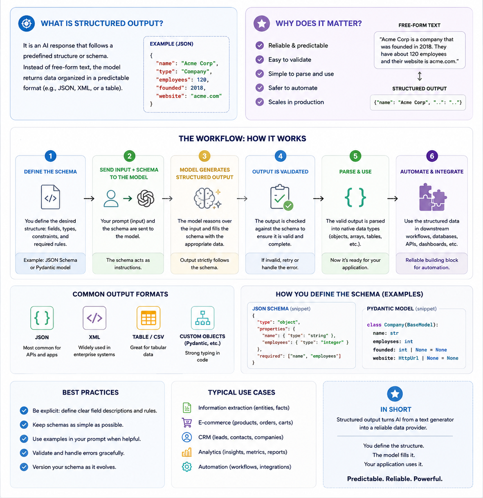

+++

title = "[AgI] Prompt Engineering & Structured Outputs"
description = "How to design prompts, apply prompting techniques, and get machine-readable outputs from LLMs"
outputs = ["Reveal"]

+++

# Prompt Engineering & Structured Outputs

{}

---

## Outline

1. [Anatomy of a prompt](#/prompt-anatomy): what a prompt is made of, and some general best practices
2. [Structured outputs](#/structured-output): how to get _machine-readable_ responses out of LLMs
    + first with OpenAI's client library, then with [LangChain](https://www.langchain.com/), which we'll keep using from then on
3. [Prompting techniques](#/prompting-techniques): zero-shot, few-shot, chain-of-thought, self-consistency, prompt chaining
4. [Reasoning models](#/reasoning-models): models which "think" before answering, and how to control how much they think
5. [Context management](#/context-management): context windows, token budgets, compaction, prompt caching
6. Exercises on the running example: [checklist scoring](#/exercise-checklist), [ID documents extraction](#/exercise-id-documents)

> Validating generative software is the topic of the [next lecture](../validating/)

> Recall: we assume the reader is familiar with the [Chat Completion API](../llmaas/#/chat-completion-concept), and with the notion of [prompt templates](../genai/) from previous lectures

---

{}



## What is a _prompt_? The general concept

- A __prompt__ is _the whole input_ that is given to an LLM, in order to elicit some _desired output_
    + in the Chat Completion API, it is the _list of messages_ sent in a request (system, user, assistant, ...)
    + the model sees nothing else: _everything_ it needs to know must be in there

- __Prompt engineering__ is the practice of _designing_, _testing_, and _refining_ prompts, so that the model's responses become more _accurate_, _consistent_, and _useful_ for the task at hand
    + it is __empirical__: there is no theory telling in advance which prompt works best on which model
    + hence, it is only meaningful when paired with some form of _evaluation_ (more on this in the next lectures)

- A prompt is commonly made of _four_ (optional) __elements__ (cf. [Prompt Engineering Guide](https://www.promptingguide.ai/introduction/elements)):
    1. __instructions__: the _task_ to be performed, and _how_ to perform it (e.g. "score this letter")
    2. __context__: _background information_ that may help the model (e.g. "you are assisting a PhD admission committee")
    3. __input data__: the _specific_ data to be processed (e.g. the text of the letter)
    4. __output indicator__: the _format_ or _type_ of the expected output (e.g. "answer in JSON, with fields ...")

---

## Anatomy of a prompt: an intuitive example



- The __system__ prompt commonly contains the _stable_ parts (context, general instructions, output format)
- The __user__ prompt commonly contains the _variable_ parts (input data, specific instructions)
    + this separation makes prompts easy to _templatize_: fixed text + _named placeholders_ filled at runtime

---

## Prompt engineering best practices: the landscape

- Each provider publishes its own __prompting guide__, and _most advice is shared_ across them:
    + [OpenAI](https://developers.openai.com/api/docs/guides/prompt-engineering), [Anthropic](https://platform.claude.com/docs/en/build-with-claude/prompt-engineering/overview), [Google](https://ai.google.dev/gemini-api/docs/prompting-strategies), [Mistral](https://docs.mistral.ai/guides/prompting_capabilities/)
    + surveys: [Schulhoff et al., _The Prompt Report_ (2024)](https://arxiv.org/abs/2406.06608), [Sahoo et al. (2024)](https://arxiv.org/abs/2402.07927)

| Practice | Rationale | Example |
|---|---|---|
| Be _clear_ and _specific_ | the model cannot read your mind | "summarise in 3 bullet points, max 15 words each" vs. "summarise" |
| Give a _role_ / _context_ | narrows down the space of plausible answers | "You are assisting the admission committee of ..." |
| Use _delimiters_ | separates instructions from data (and mitigates injection) | `<letter> ... </letter>`, Markdown headings, triple quotes |
| Say what _to do_, not only what _not to do_ | negative instructions are followed less reliably | "use plain words" vs. "don't use jargon" |
| Provide _examples_ | showing is more effective than telling | cf. [few-shot prompting](#/prompting-techniques) |
| Specify the _output format_ | downstream code needs to parse the response | cf. [structured outputs](#/structured-output) |
| Let the model _think_ first | complex tasks benefit from intermediate steps | cf. [chain-of-thought](#/prompting-techniques) and [reasoning models](#/reasoning-models) |
| _Iterate_ and _measure_ | prompts behave differently across models and versions | keep a set of test inputs with expected outputs |

- Guides also contain _model-specific_ advice (e.g. Claude likes XML tags, reasoning models need _less_ step-by-step guidance)
    + prompts are __not portable__ across models: re-test them whenever you switch model

{}

---





---



## About Structured Output

__TL;DR__: forcing the model to _produce output_ in a specific format (e.g. JSON matching a given schema) so that to bring unstructured input data (e.g. natural language) into structured form that can be easily processed by downstream applications (e.g. databases, APIs, etc.)



---

## How to represent target structured format to the model?

1. __Natural language description__: describe the target format in natural language
    - e.g. "the output should be a JSON object with the following fields: name (string), age (integer), email (string), etc."

2. __Example-based description__: provide one or more examples of the target format,
    - e.g. "the output should look like this: `{ "name": "John Doe", "age": 30, "email": "john.doe@example.com" }`

3. __Schema-based description__: provide a formal schema (e.g. JSON Schema) describing the target format, e.g. "the output should match the following JSON Schema (written in YAML for better readability):

    ```yaml
    type: object
    properties:
      name:
        type: string
      age:
        type: integer
      email:
        type: string
    required: [name, age, email]
    additionalProperties: false
    ```

4. In _strongly-typed_ programming languages (e.g. Java), client libraries may _reverse-engineer_ the schema from the _type definitions_ in the code, using __reflection__, or leverage serialization libraries such as [Jackson](https://github.com/FasterXML/jackson)

5. In _Python_, one can use [libraries like `pydantic`](https://docs.pydantic.dev/) to define _data models_ with validation logic, and then __generate__ JSON Schemas from them
    + this is so common, that LLM-aaS Client Libraries (there including `openai`) often have built-in support for `pydantic` models

---

{}

## Pydantic classes with documentation strings (pt. 1)

1. Core idea behind `pydantic` is to define _data models_ as __Python classes__ extending `pydantic.BaseModel`
    + with type __annotations__ for the _fields_, also borrowing types from the Python standard library (e.g. `datetime`, `Optional`, etc.)

    ```python
    from typing import Optional
    from pydantic import BaseModel
    from datetime import datetime

    class User(BaseModel):
        name: str
        age: int
        email: Optional[str] = None

    class Post(BaseModel):
        title: str
        content: str
        author: User
        timestamp: datetime
    ```

    + one may also have nested data models, _optional_ fields, _default_ values, etc.
    + `pydantic` data model $\approx$ data classes with default _validation_ and _serialization_ logic
        - automatically implemented constructurs accepting arguments named after the field, with _type_ checking and validation (e.g. `User(name="John Doe", age=30)`)
        - methods to serialize the model to JSON (e.g. `user.model_dump_json()`) and to generate JSON Schema (e.g. `User.model_json_schema()`)

---

## Pydantic classes with documentation strings (pt. 2)

2. To make the data model understandable to the LLM, one _should_ add __documentation strings__ to the fields, which will be included in the generated JSON Schema as `description` fields—also good for setting _default values_ or default _factories_

    ```python
    from typing import Optional
    from pydantic import BaseModel, Field # <-- notice the import of Field for adding documentation strings
    from datetime import datetime

    class User(BaseModel):
        """Anagraphical and contact information about a user."""

        name: str = Field(..., description="The user's full name")
        age: int = Field(..., description="The user's age in years")
        email: Optional[str] = Field(default=None, description="The user's email address")

    class Post(BaseModel):
        """A blog post created by a user."""

        title: str = Field(..., description="The title of the post")
        content: str = Field(..., description="The content of the post")
        author: User = Field(..., description="The author of the  post")
        created_at: datetime = Field(default_factory=datetime.now, description="The date and time when the post was created")

    ```

3. For instance, the class definitions above would produce the following JSON Schema (formatted in YAML for better readability):

    ```yaml
    title: Post
    type: object
    description: A blog post created by a user.
    properties:
      title:
        description: The title of the post
        title: Title
        type: string
      content:
        description: The content of the post
        title: Content
        type: string
      author:
        "$ref": "#/$defs/User"
        description: The author of the  post
      created_at:
        description: The date and time when the post was created
        format: date-time
        title: Created At
        type: string
    required: [title, content, author]
    "$defs":
      User:
        description: Anagraphical and contact information about a user.
        properties:
          name:
            description: The user's full name
            title: Name
            type: string
          age:
            description: The user's age in years
            title: Age
            type: integer
          email:
            anyOf:
            - type: string
            - type: 'null'
            default:
            description: The user's email address
            title: Email
        required:
        - name
        - age
        title: User
        type: object
    ```

{}

---

{}

## How is structured output _enforced_? (pt. 1)

From _weakest_ to _strongest_ guarantees:

1. __Prompt-only__: describe the format in the prompt, then _parse_ (and _validate_) the response
    + works with _any_ model, yet the output may be _malformed_ (missing fields, extra text, Markdown fences around JSON...)
2. __JSON mode__ (e.g. `response_format={"type": "json_object"}`): the output is guaranteed to be _valid JSON_, but not to match your _schema_
3. __Schema-constrained output__ (e.g. `response_format={"type": "json_schema", ..., "strict": true}`): the output is guaranteed to match the _JSON Schema_
    + commonly implemented via __constrained decoding__: at each generation step, tokens that would violate the schema are _masked out_
    + cf. [Willard & Louf (2023)](https://arxiv.org/abs/2307.09702), and libraries such as [Outlines](https://github.com/dottxt-ai/outlines), [llguidance](https://github.com/guidance-ai/llguidance), [XGrammar](https://github.com/mlc-ai/xgrammar)

    

4. __Tool-calling trick__: declare a (fake) _tool_ whose parameters are the target schema, and _force_ the model to call it
    + the tool-call _arguments_ are the structured output (common before providers supported (3))


---

## How is structured output _enforced_? (pt. 2)

| Provider / tool | How to request schema-constrained output | Docs |
|---|---|---|
| OpenAI (Chat Completion) | `response_format={"type": "json_schema", "json_schema": {..., "strict": True}}`, or `client.chat.completions.parse(response_format=PydanticClass)` | [link](https://developers.openai.com/api/docs/guides/structured-outputs) |
| OpenAI-compatible (e.g. OpenRouter) | same as OpenAI, _if_ the underlying model supports it | [link](https://openrouter.ai/docs/features/structured-outputs) |
| Anthropic (Messages) | `output_config={"format": {"type": "json_schema", "schema": ...}}`, or _strict tool use_ | [link](https://platform.claude.com/docs/en/build-with-claude/structured-outputs) |
| Google Gemini | JSON mime type + JSON Schema in the request configuration | [link](https://ai.google.dev/gemini-api/docs/structured-output) |
| Ollama (local) | `format=<JSON Schema>` in the request | [link](https://docs.ollama.com/capabilities/structured-outputs) |
| LangChain (any of the above) | `llm.with_structured_output(PydanticClass)` | [link](https://docs.langchain.com/oss/python/langchain/structured-output) |

- __Same concept__ everywhere: a _JSON Schema_ travels along with the request, and the response is (guaranteed to be) an instance of it
- __Different syntax__: parameter names and nesting differ across providers, and _not all models_ support all options
    + in _Python_, most client libraries accept `pydantic` classes directly, and convert them into JSON Schemas for you

> [BEWARE] the _format_ is guaranteed to be correct, the _content_ is not: always _validate_ the values

{}

---

{}



## Example 1: Structured Output with Pydantic Classes (pt. 1)

> __Goal__: let's _extract_ structured information from the candidates' _presentation letters_
- In particular:
    + information about the _applicant_ (name, strengths, weaknesses, etc.), to see whether the letter is actually _positive_
    + information about the _authors_ of the letter (e.g. name, position, relationship with the applicant, etc.), to see whether the letter is actually _credible_
    + give a reproducible and grounded _recipe_ for __scoring__ the letter based on these aspects

{}

1. Let's import `openai` and initialize the client as usual:

    {}

2. Let's design a system prompt to contain general instructions for the model

    {}

{}

---

## Example 1: Structured Output with Pydantic Classes (pt. 2)

3. Let's define `pydantic` classes to represent the target format, with _documentation strings_ to complement the specification

    - Imports:

        {}

    - A class for the _applicant_'s information:

        {}

    - A class for the _author_'s information:

        {}

    - A class for the overall _scoring_ of the letter, including the extracted information and the final score:

        {}

        * notice that instructions for scoring are contained in another string

---

## Example 1: Structured Output with Pydantic Classes (pt. 3)

4. _Instructions_ for _scoring_ can be provided as well in _natural language_, yet better to be precise and give the LLM a _"recipe"_ for scoring

    {}

5. With these ingredients in mind, the automatic scoring logic is as simple as a _single request–response interaction_ with the LLM:

    {}

    notice that:

    - function `client.chat.completions.`<u>`parse`</u>`(...)` is called in place of `.create(...)`
        + to automatically parse the model's response into an instance of the `LetterInfo`
    - the `response_format` parameter is set to a _reference_ to the `LetterInfo` class
        + `openai` will automatically generate the corresponding JSON Schema from the class definition, and include it in the request

---

## Example 1: Structured Output with Pydantic Classes (pt. 4)

6. Full code [here](../scripts/letter_scoring_openai.py)

7. At this point, the logic of the program is trivial (load letter file $\rightarrow$ call `score_letter(...)` $\rightarrow$ print the result):

    {}

8. Possible results below:

{}
{}
{}
{}
{}
{}
{}
{}
{}
{}
{}

---

## Example 1: Project Structure

Re-create the following project, by downloading (or copy-pasting) the files below, then run the commands from its _root_ directory:

<div class="highlight"><pre tabindex="0" style="background-color:#f8f8f8;"><code class="nohighlight" data-noescape>&lt;root dir&gt;/
├── data/
│   ├── <a href="../data/letter-jean-dupont.txt">letter-jean-dupont.txt</a>      # inputs (running example)
│   ├── <a href="../data/letter-mario-rossi.txt">letter-mario-rossi.txt</a>
│   └── <a href="../data/letter-mohammed-ali.txt">letter-mohammed-ali.txt</a>
├── scripts/
│   └── <a href="../scripts/letter_scoring_openai.py">letter_scoring_openai.py</a>    # the letter-scoring system
├── <a href="../requirements.txt">requirements.txt</a>                # dependencies of all examples
└── .venv/                          # virtual environment (created below)</code></pre></div>

```bash
python -m venv .venv && source .venv/bin/activate   # on Windows: .venv\Scripts\activate
pip install -r requirements.txt
```

- set the environment variables `OPENAI_API_KEY` (and, optionally, `OPENAI_BASE_URL`, `OPENAI_MODEL`), cf. [Free Access to LLMs](../free-access/)

{}

---

{}



## About LangChain

- [LangChain](https://www.langchain.com/) is a _third-party_, _open-source_ framework for building LLM-based applications ([docs](https://docs.langchain.com/oss/python/langchain/overview))
    + available in [Python](https://github.com/langchain-ai/langchain) and [JavaScript/TypeScript](https://github.com/langchain-ai/langchainjs)
    + by the same company: [LangGraph](https://www.langchain.com/langgraph) (workflows, in later lectures), and [LangSmith](https://www.langchain.com/langsmith) (observability and evaluation)

- It provides a __uniform meta-model__ on top of _many_ providers' APIs:
    + __chat models__ (e.g. `ChatOpenAI`, `ChatAnthropic`, `ChatGoogleGenerativeAI`, `ChatOllama`): one class per provider, _same_ interface
        * each one is shipped in a separate package (e.g. `pip install langchain-openai`)
    + __messages__ (`SystemMessage`, `HumanMessage`, `AIMessage`, ...), __prompt templates__, __output parsers__, __tools__, ...
    + all of them are __runnables__: objects with `.invoke(input)`, `.batch(inputs)`, `.stream(input)` (and `async` variants), which can be _composed_ with the `|` operator

- __Why__ bother?
    + switching provider = changing _one line_ (the chat model class), not rewriting the program
    + higher-level abstractions (templates, structured output, tools, agents, RAG) come _for free_

- __Why not__?
    + one more layer of _indirection_ (and of dependencies, and of breaking changes)
    + provider-specific features may lag behind, or be available only via "escape hatches" (e.g. `extra_body`)

---

## Example 1 (bis): the same Letter Scoring System with LangChain (pt. 1)

1. Let's import LangChain's chat model for OpenAI-compatible APIs, and initialize it (notice that the _same_ environment variables are used):

    {}

2. Let's define the prompt as a __template__, with a _named placeholder_ (`{letter_text}`) for the input data:

    {}

    - `ChatPromptTemplate.from_messages` accepts a list of `(role, template)` pairs
    - `prompt.invoke({"letter_text": "..."})` would produce the _list of messages_ to be sent to the model

3. `pydantic` classes and scoring instructions are _exactly the same_ as in the OpenAI version (full code [here](../scripts/letter_scoring_langchain.py))

---

## Example 1 (bis): the same Letter Scoring System with LangChain (pt. 2)

4. The scoring logic is a __chain__: _prompt template_ $\rightarrow$ _chat model_ constrained to produce `LetterInfo` instances:

    {}

    notice that:

    - `llm.with_structured_output(LetterInfo)` returns a _new runnable_, whose output is an instance of `LetterInfo`
        + the `method` argument selects _how_ structure is enforced: `"json_schema"` (default for OpenAI), `"function_calling"` (tool-calling trick), or `"json_mode"`
        + `include_raw=True` returns the _raw_ response too (useful to inspect token usage, or parsing errors)
    - `prompt | ...` creates a _sequence_: the output of the template (messages) is the input of the model
    - `scoring_chain.invoke({...})` runs the whole chain, `scoring_chain.batch([{...}, {...}])` runs it on _many_ inputs, in _parallel_

5. The `main` part of the program is unchanged:

    ```bash
    python scripts/letter_scoring_langchain.py data/letter-mario-rossi.txt
    ```

---

## Example 1 (bis): Project Structure

Re-create the following project, by downloading (or copy-pasting) the files below, then run the commands from its _root_ directory:

<div class="highlight"><pre tabindex="0" style="background-color:#f8f8f8;"><code class="nohighlight" data-noescape>&lt;root dir&gt;/
├── data/
│   ├── <a href="../data/letter-jean-dupont.txt">letter-jean-dupont.txt</a>      # inputs (running example)
│   ├── <a href="../data/letter-mario-rossi.txt">letter-mario-rossi.txt</a>
│   └── <a href="../data/letter-mohammed-ali.txt">letter-mohammed-ali.txt</a>
├── scripts/
│   └── <a href="../scripts/letter_scoring_langchain.py">letter_scoring_langchain.py</a> # the letter-scoring system
├── <a href="../requirements.txt">requirements.txt</a>                # dependencies of all examples
└── .venv/                          # virtual environment (created below)</code></pre></div>

```bash
python -m venv .venv && source .venv/bin/activate   # on Windows: .venv\Scripts\activate
pip install -r requirements.txt
```

- set the environment variables `OPENAI_API_KEY` (and, optionally, `OPENAI_BASE_URL`, `OPENAI_MODEL`), cf. [Free Access to LLMs](../free-access/)

---

## OpenAI client vs. LangChain: analogies and differences

| Aspect | `openai` client | LangChain |
|---|---|---|
| Model access | `OpenAI(base_url, api_key)` + `model=` at each request | `ChatOpenAI(base_url, api_key, model)`, once |
| Prompt | list of `dict(role=..., content=...)`, built with f-strings | `ChatPromptTemplate` with _named placeholders_ |
| Structured output | `client.chat.completions.parse(response_format=Class)` | `llm.with_structured_output(Class)` |
| Result | `response.choices[0].message.parsed` (check `.refusal`!) | the `Class` instance, directly |
| Composition | plain Python functions | runnables composed with `\|` |
| Batching / parallelism | up to you (e.g. `asyncio`) | `.batch(...)`, `.abatch(...)` |
| Other providers | only OpenAI-compatible APIs | any provider with a LangChain integration |
| Access to provider-specific features | _immediate_ | may require `extra_body=...` or `model_kwargs=...` |

- The _concepts_ (messages, roles, JSON Schema, `pydantic` classes) are the __same__: only the _syntax_ changes
- From now on, we'll stick to __LangChain__

{}

---



## Exercise 1: Improving Letter Scoring with (even more) Structured Output

> __Problem__: the scoring recipe provided to the model is still quite vague and unstructured, which may lead to _inconsistent_ and _non-reproducible_ scores. Even when good, scores are not _explainable_, as the reasoning behind them is not made explicit.

{}
### TO-DO List
1. start from the [LangChain version](../scripts/letter_scoring_langchain.py) of the letter-scoring system
2. let's turn the scoring recipe into a _checklist_ of criteria
3. let's have a Pydantic class with as many __boolean fields__ as the criteria in the checklist
4. let's ask the _LLM_ to set the boolean fields by analysing the _input letter_
5. let's write down the _algorithm_ to compute the final score based on the boolean fields, as a _function_ in the Pydantic _class_
    + the scoring logic is now _reproducible_ and _explainable_
    + the hallucination margin is reduced, as the model is not asked to directly produce a score, but rather to fill in the boolean fields based on the content of the letter, which is an easier task
{}

---

{}



## Prompting techniques: the general concept

| Technique | Idea | Reference |
|---|---|---|
| __Zero-shot__ | only _instructions_, no examples | [Radford et al. (2019)](https://cdn.openai.com/better-language-models/language_models_are_unsupervised_multitask_learners.pdf) |
| __Few-shot__ (a.k.a. _in-context learning_) | instructions + a few _solved examples_ (input $\rightarrow$ expected output) | [Brown et al. (2020)](https://arxiv.org/abs/2005.14165) |
| __Chain-of-Thought__ (CoT) | ask the model to write _intermediate reasoning steps_ before the answer | [Wei et al. (2022)](https://arxiv.org/abs/2201.11903) |
| __Zero-shot CoT__ | just add _"Let's think step by step"_ | [Kojima et al. (2022)](https://arxiv.org/abs/2205.11916) |
| __Self-consistency__ | sample _many_ answers (with temperature > 0), then take a _majority vote_ | [Wang et al. (2023)](https://arxiv.org/abs/2203.11171) |
| __Prompt chaining__ | split a complex task into a _sequence_ of simpler prompts, each feeding the next | [Wu et al. (2022)](https://arxiv.org/abs/2110.01691) |

- More techniques exist (e.g. _tree of thoughts_, _ReAct_, _self-refine_): see [The Prompt Report](https://arxiv.org/abs/2406.06608) for a taxonomy
    + _ReAct_ (reasoning + acting) will be the basis of _agents_, in the next lecture
- Techniques __combine__: e.g. few-shot + CoT + self-consistency

---

## Prompting techniques: an intuitive example



---

## Prompting techniques in LangChain: the technological landscape

- Techniques are _about the prompt_, hence they're mostly _provider-agnostic_: any chat model can be used
- What frameworks offer is __support for building__ such prompts, and for running them _many times_:

| Technique | Raw client library | LangChain |
|---|---|---|
| Zero-shot | list of messages | `ChatPromptTemplate.from_messages([...])` |
| Few-shot | append example (user, assistant) pairs by hand | `FewShotChatMessagePromptTemplate`, optionally with an _example selector_ (e.g. by semantic similarity) |
| CoT | add "think step by step", or a `reasoning` field in the output schema | same, with `with_structured_output(...)` |
| Self-consistency | $N$ requests (e.g. via `asyncio`), then vote | `chain.batch([input] * N)`, then vote |
| Prompt chaining | call the model, parse, build next prompt, call again | compose runnables with `\|` (e.g. `prompt1 \| llm \| parser \| prompt2 \| llm`) |

- Docs: [prompt templates](https://reference.langchain.com/python/langchain-core/prompts/), [runnables and LCEL](https://docs.langchain.com/oss/python/langchain/overview)
- Other frameworks follow the same ideas (e.g. [DSPy](https://dspy.ai/) goes further, and _optimises_ prompts and examples automatically)

{}

---

{}



## Example 2: Classifying Letters' Tone, with Several Techniques (pt. 1)

> __Goal__: classify the _tone_ of each presentation letter as `enthusiastic`, `lukewarm`, or `critical`, and compare techniques

1. Let's initialize the chat model (notice `temperature=1.0`: we want _variability_, for self-consistency):

    {}

2. The system prompt defines the _labels_; the output is constrained to them via a `Literal` type:

    {}

    - the __zero-shot__ prompt is just _system instructions_ + _user input_

---

## Example 2: Classifying Letters' Tone, with Several Techniques (pt. 2)

3. The __few-shot__ prompt adds _solved examples_, rendered as _past turns_ of the conversation (user asks, assistant answers):

    {}

    - examples should be _diverse_ (one per label, at least), _short_, and _representative_ of real inputs
    - the _format_ and the _label distribution_ of examples matter at least as much as their correctness (cf. [Min et al. (2022)](https://arxiv.org/abs/2202.12837))

---

## Example 2: Classifying Letters' Tone, with Several Techniques (pt. 3)

4. __Chain-of-thought__ via structured output: a `reasoning` field is placed _before_ the `label` field:

    {}

    - models generate JSON fields __in order__: the label is produced _after_ (and _conditioned on_) the reasoning
        + putting `reasoning` _after_ `label` would make it a mere _post-hoc justification_
    - tight format constraints may _hinder_ reasoning (cf. [Tam et al. (2024)](https://arxiv.org/abs/2408.02442)): leaving free-text room for reasoning helps

---

## Example 2: Classifying Letters' Tone, with Several Techniques (pt. 4)

5. __Self-consistency__: run _the same_ chain $N$ times, in parallel, and take the _majority_ vote:

    {}

6. Let's try it (full code [here](../scripts/letter_tone.py)):

    ```bash
    python scripts/letter_tone.py zero-shot data/letter-jean-dupont.txt
    python scripts/letter_tone.py few-shot data/letter-jean-dupont.txt
    python scripts/letter_tone.py cot data/letter-jean-dupont.txt 5     # CoT + self-consistency, 5 samples
    ```

    - the script also _prints_ the prompt template, so you can see what each technique actually sends
    - try with the other letters, and with _different models_: which technique makes the answers most _stable_?

---

## Example 2: Project Structure

Re-create the following project, by downloading (or copy-pasting) the files below, then run the commands from its _root_ directory:

<div class="highlight"><pre tabindex="0" style="background-color:#f8f8f8;"><code class="nohighlight" data-noescape>&lt;root dir&gt;/
├── data/
│   ├── <a href="../data/letter-jean-dupont.txt">letter-jean-dupont.txt</a>      # inputs (running example)
│   ├── <a href="../data/letter-mario-rossi.txt">letter-mario-rossi.txt</a>
│   └── <a href="../data/letter-mohammed-ali.txt">letter-mohammed-ali.txt</a>
├── scripts/
│   └── <a href="../scripts/letter_tone.py">letter_tone.py</a>              # tone classification
├── <a href="../requirements.txt">requirements.txt</a>                # dependencies of all examples
└── .venv/                          # virtual environment (created below)</code></pre></div>

```bash
python -m venv .venv && source .venv/bin/activate   # on Windows: .venv\Scripts\activate
pip install -r requirements.txt
```

- set the environment variables `OPENAI_API_KEY` (and, optionally, `OPENAI_BASE_URL`, `OPENAI_MODEL`), cf. [Free Access to LLMs](../free-access/)

---

## Prompting techniques: trade-offs

| Technique | Extra tokens per request | Extra requests | Best for | Watch out for |
|---|---|---|---|---|
| Zero-shot | none | none | simple, well-specified tasks; strong models | ambiguous label definitions |
| Few-shot | examples (input side) | none | tasks where the format or the _borderline cases_ are hard to describe | biased or unrepresentative examples |
| CoT | reasoning (output side, _pricier_) | none | multi-step tasks (maths, logic, multi-criteria judgments) | longer latency; reasoning may be unfaithful |
| Self-consistency | $\times N$ | $N - 1$ | tasks with a _single_ correct answer, when reliability matters | cost; open-ended answers cannot be voted |
| Prompt chaining | depends | one per step | complex tasks with _separable_ steps | error propagation across steps |

- Output tokens are commonly __more expensive__ than input ones (cf. [pricing](../llmaas/))
- Always __measure__: on strong or _reasoning_ models, some techniques (e.g. CoT prompting) bring little benefit, or even harm (cf. [Sprague et al. (2024)](https://arxiv.org/abs/2409.12183))

{}

---

{}



## Reasoning models: the general concept

- __Reasoning models__ (a.k.a. _thinking_ models) are LLMs trained to produce a (possibly long) _chain of thought_ __before__ the final answer, _without being asked to_
    + i.e. CoT is _built into the model_, via reinforcement learning on tasks with verifiable answers (maths, code, logic)
    + e.g. OpenAI's o-series and GPT-5+, [DeepSeek-R1](https://arxiv.org/abs/2501.12948), Claude with extended/adaptive thinking, Gemini "thinking" models, Qwen3, `gpt-oss`

- The chain of thought is made of __reasoning tokens__:
    + they are _generated_ (hence __billed__, as output tokens) and they _consume_ the context window
    + they may be _hidden_, _summarised_, or _returned_, depending on the provider
    + they trade __latency and cost__ for __quality__ on hard tasks ("test-time compute")

- Most APIs let you control _how much_ the model thinks, via a __reasoning effort__ level (e.g. `low` / `medium` / `high`), or a __token budget__

---

## Reasoning models: an intuitive example



---

## Reasoning models: the technological landscape

| Provider | How to control reasoning | Where reasoning tokens are counted | Docs |
|---|---|---|---|
| OpenAI | `reasoning_effort` (Chat Completion), `reasoning={"effort": ...}` (Responses) | `usage.completion_tokens_details.reasoning_tokens` | [link](https://developers.openai.com/api/docs/guides/reasoning) |
| Anthropic | `output_config={"effort": ...}`; `thinking={...}` to enable/disable thinking, or set a budget (older models) | `usage.output_tokens` (thinking included) | [link](https://platform.claude.com/docs/en/build-with-claude/effort) |
| Google Gemini | `thinking_level` (Gemini 3+), `thinking_budget` (Gemini 2.5) | `usage_metadata.thoughts_token_count` | [link](https://ai.google.dev/gemini-api/docs/thinking) |
| OpenRouter | unified `reasoning={"effort": ...}` or `reasoning={"max_tokens": ...}`, mapped onto each provider | `usage.completion_tokens_details.reasoning_tokens` | [link](https://openrouter.ai/docs/guides/best-practices/reasoning-tokens) |
| Ollama (local) | `think=True` / `False` (or a level, for some models) | — | [link](https://docs.ollama.com/capabilities/thinking) |
| LangChain | provider-specific arguments (e.g. `ChatOpenAI(reasoning_effort=...)`), or `extra_body={...}` | `response.usage_metadata["output_token_details"]["reasoning"]` | [link](https://docs.langchain.com/oss/python/integrations/chat/openai) |

- __Same concept__ (effort levels or budgets), __different syntax__, and _different levels_ per model (e.g. `minimal`, `none`, `xhigh`, `max`)
- _Non-reasoning_ models simply ignore (or reject!) these parameters

---

## Example 3: Reasoning Effort vs. Latency and Cost (pt. 1)

> __Goal__: _rank_ the three candidates according to their letters, at _different_ reasoning efforts, and compare

1. Let's pick a _reasoning_ model by default (e.g. [`openai/gpt-oss-20b`](https://openrouter.ai/openai/gpt-oss-20b)), and write the question as a template:

    {}

2. For each effort level, let's create a chat model passing OpenRouter's `reasoning` parameter via `extra_body`, then measure _time_ and _tokens_:

    {}

    - `extra_body` is LangChain's _escape hatch_ to send provider-specific parameters, not (yet) modelled by `ChatOpenAI`
    - `usage_metadata` is LangChain's _provider-agnostic_ view of token usage

---

## Example 3: Reasoning Effort vs. Latency and Cost (pt. 2)

3. Let's run it on all letters (full code [here](../scripts/reasoning_effort.py)):

    {}

    ```bash
    python scripts/reasoning_effort.py data/letter-*.txt
    ```

4. Things to observe:
    - how do _latency_ and _reasoning tokens_ grow with effort?
    - does the _ranking_ change? Is it more _stable_ across runs at higher efforts?
    - what happens with a _non-reasoning_ model (e.g. set `OPENAI_MODEL` accordingly)?

---

## Example 3: Project Structure

Re-create the following project, by downloading (or copy-pasting) the files below, then run the commands from its _root_ directory:

<div class="highlight"><pre tabindex="0" style="background-color:#f8f8f8;"><code class="nohighlight" data-noescape>&lt;root dir&gt;/
├── data/
│   ├── <a href="../data/letter-jean-dupont.txt">letter-jean-dupont.txt</a>      # inputs (running example)
│   ├── <a href="../data/letter-mario-rossi.txt">letter-mario-rossi.txt</a>
│   └── <a href="../data/letter-mohammed-ali.txt">letter-mohammed-ali.txt</a>
├── scripts/
│   └── <a href="../scripts/reasoning_effort.py">reasoning_effort.py</a>         # ranking at several efforts
├── <a href="../requirements.txt">requirements.txt</a>                # dependencies of all examples
└── .venv/                          # virtual environment (created below)</code></pre></div>

```bash
python -m venv .venv && source .venv/bin/activate   # on Windows: .venv\Scripts\activate
pip install -r requirements.txt
```

- set the environment variables `OPENAI_API_KEY` (and, optionally, `OPENAI_BASE_URL`, `OPENAI_MODEL`), cf. [Free Access to LLMs](../free-access/)

---

## Reasoning models: when and how to use them?

- __When__: multi-step problems (maths, code, planning, multi-criteria decisions), where a wrong answer costs more than a slow one
- __When not__: simple extraction, classification, or chit-chat, where _latency_ and _cost_ matter more
    + start _low_, and raise effort only if your evaluations show that quality improves

- __How to prompt__ them (cf. [OpenAI](https://developers.openai.com/api/docs/guides/reasoning-best-practices), [Anthropic](https://platform.claude.com/docs/en/build-with-claude/prompt-engineering/overview) guides):
    + give _high-level goals_ and _constraints_, rather than step-by-step instructions: they plan by themselves
    + explicit CoT prompting (e.g. "think step by step") is mostly _redundant_
    + few-shot examples may still help for the _format_, less for the _reasoning_
    + leave enough room in `max_tokens`: it bounds _reasoning + answer_ together

- Reasoning traces are __not__ faithful explanations of how the answer was computed (cf. [Chen et al. (2025)](https://arxiv.org/abs/2505.05410)): do not use them as _justifications_ for decisions about people

{}

---

{}



## Exercise 2: Extract Structured Information from Pictures (pt. 1)

> __Goal__: let's say the committee wants to extract structured information from the ID documents of the candidates, which are provided as pictures in the application form, and wants to be _confident_ about the extracted values

{}
### TO-DO List
1. let's use some LLM with _vision capabilities_ (e.g. [OR model `google/gemma-4-26b-a4b-it:free`](https://openrouter.ai/google/gemma-4-26b-a4b-it:free))
2. let's design a _system prompt_ (context, general instructions) and a _user prompt_ (specific instructions + the picture) to ask the model to extract structured information from the ID document, such as name, date of birth, ID number, _expiration date_, etc.
3. let's define a Pydantic class to represent the extracted information, with appropriate fields and documentation strings
4. let's call the LLM _with the picture_ of the ID document as input, and get the structured information as output
5. let's query the model _several times_ for the same picture, and keep, _field by field_, the most voted value (cf. [self-consistency](#/letter-tone))
    + fields with _no clear majority_ should be flagged for _human_ review
6. let's test the program with _different ID documents_, and see how well the model can extract the information
{}

---

## Exercise 2: Extract Structured Information from Pictures (pt. 2)

### How to pass images to the model?

- Many ways, documented [here](https://docs.langchain.com/oss/python/langchain/messages#multimodal), simplest one is passing a [base64-encoded](https://en.wikipedia.org/wiki/Base64) image in the `content` of a message
    + the `content` is now a _list_ of _typed_ pieces (text, image, ...)
    + LangChain converts them into each provider's format (for OpenAI: `{"type": "image_url", "image_url": {"url": "data:..."}}`)

- [HOW-TO] Constructing a message with both _text_ and _image_ content:

    ```python
    import base64
    from langchain_core.messages import HumanMessage

    def message_with_image(text, image_path, mime_type="image/png"):
        with open(image_path, "rb") as image_file:
            data = base64.b64encode(image_file.read()).decode("utf-8")
        return HumanMessage(content=[
            {"type": "text", "text": text},
            {"type": "image", "base64": data, "mime_type": mime_type},
        ])
    ```

- [HOW-TO] Define the _Pydantic class_ to represent the expected structured information extracted from the ID document:

    ```python
    from pydantic import BaseModel, Field
    from datetime import date

    class IDDocumentInfo(BaseModel):
        """Structured information extracted from an ID document."""

        name: str = Field(..., description="The full name of the person in the ID document")
        date_of_birth: date = Field(..., description="The date of birth of the person in the ID document")
        id_number: str = Field(..., description="The ID number of the document")
        expiration_date: date = Field(..., description="The expiration date of the document")
    ```

---

## Exercise 2: Extract Structured Information from Pictures (pt. 3)

- [HOW-TO] Call the LLM with the message containing the image, and get an instance of the `IDDocumentInfo` class:

    ```python
    from langchain_core.messages import SystemMessage
    from langchain_openai import ChatOpenAI

    llm = ChatOpenAI(..., model="google/gemma-4-26b-a4b-it:free")
    extractor = llm.with_structured_output(IDDocumentInfo)

    messages = [
        SystemMessage("You are an assistant that extracts structured information from ID documents."),
        message_with_image("Please extract the information from this ID document.", "data/passport-mario-rossi.png"),
    ]
    results = extractor.batch([messages] * 5)  # 5 samples, for voting
    ```

- [HINT] for field-by-field voting, `collections.Counter(getattr(r, field) for r in results).most_common(1)` is your friend

---

## Exercise 2: Extract Structured Information from Pictures (pt. 4)

- [BEWARE] There are limitations w.r.t. input data [on OpenAI](https://developers.openai.com/api/docs/guides/images-vision#image-input-requirements) (and what about [OR](https://openrouter.ai/docs/guides/overview/multimodal/image-understanding)?)

    

{}

---

{}



## Context management: the general concept

- The __context window__ is the _maximum number of tokens_ a model can process in a _single_ request: _input_ (all messages) + _output_ (including reasoning tokens)
    + from a few thousands (small local models) to millions (some frontier models) of tokens, cf. [model zoos](../llmaas/#/model-zoos)
    + exceeding it leads to _errors_, or to _silent truncation_, depending on the provider

- Recall: the Chat Completion API is __stateless__, so the _client_ re-sends the _whole history_ at each turn
    + hence, the input grows at _each turn_, and so do _cost_ and _latency_
    + the _cumulative_ cost of a conversation grows __quadratically__ with the number of turns

- Even _within_ the window, _more_ context is not necessarily _better_:
    + information in the _middle_ of long contexts is used less effectively (cf. [Liu et al. (2024)](https://arxiv.org/abs/2307.03172))
    + performance degrades as input length grows, even on simple tasks (cf. ["context rot"](https://research.trychroma.com/context-rot))

- __Context management__ (a.k.a. _context engineering_, cf. [Anthropic](https://www.anthropic.com/engineering/effective-context-engineering-for-ai-agents)) is the practice of deciding _what_ enters the context, _when_, and _in which order_:
    1. __budgeting__: _count_ tokens, and reserve room for the output
    2. __trimming__: drop the _oldest_ (or least relevant) messages
    3. __summarisation__ (a.k.a. _compaction_): replace older messages with a _summary_ of them
    4. __retrieval__: load only the _relevant_ pieces of information, when needed (cf. RAG, in a later lecture)
    5. __prompt caching__: make the _repeated_ part of the context _cheaper_ and _faster_ to process

---

## Context management: an intuitive example



---

## Prompt caching: the general concept

- __Prompt caching__: the provider _stores_ the internal state of the model (the _KV cache_) for a _prefix_ of the prompt, and _reuses_ it when a later request starts with _exactly the same_ prefix
    + cached input tokens are billed at a _fraction_ of the price (commonly $\approx$ 10%), and processed _faster_
    + only the _prefix_ is cached: _any_ change invalidates the cache from that point on
    + caches _expire_ after some minutes of inactivity

- Consequences for prompt design:
    + put the __stable__ parts _first_ (system instructions, examples, documents), and the __variable__ parts _last_ (user input)
    + avoid timestamps or random IDs at the beginning of prompts
    + compaction and trimming _change_ the prefix: there's a _trade-off_ between shorter contexts and cache hits

- __Not__ to be confused with the _client-side_ caching of [Exercise 1 of the LLM-as-a-Service lecture](../llmaas/):

| | Client-side response caching | Provider-side prompt caching |
|---|---|---|
| What is cached | the _whole response_, for an _identical_ request | the model's state for a _prefix_ of the prompt |
| Is the model called? | no | yes, the response is always _generated_ anew |
| Saves | 100% of cost and latency | part of input cost, and time-to-first-token |
| Changes the output? | yes: same output every time (no sampling variability) | no |

---

## Context management: the technological landscape

{}

| Provider | Token counting | Prompt caching | Server-side compaction | Docs |
|---|---|---|---|---|
| OpenAI | offline, via [`tiktoken`](https://github.com/openai/tiktoken) | _automatic_ for long prompts; optional `prompt_cache_key` | `context_management` in the Responses API, or `/responses/compact` | [caching](https://developers.openai.com/api/docs/guides/prompt-caching), [compaction](https://developers.openai.com/api/docs/guides/compaction) |
| Anthropic | `/v1/messages/count_tokens` endpoint | `cache_control`: automatic (top-level) or explicit breakpoints; cache _writes_ cost extra | beta: on demand, or at a token threshold; plus _context editing_ | [caching](https://platform.claude.com/docs/en/build-with-claude/prompt-caching), [compaction](https://platform.claude.com/docs/en/build-with-claude/compaction) |
| Google Gemini | `count_tokens` method | _implicit_ (automatic), or _explicit_ caches created in advance | — | [caching](https://ai.google.dev/gemini-api/docs/caching), [tokens](https://ai.google.dev/gemini-api/docs/tokens) |
| OpenRouter | reported in `usage` | forwarded to the underlying provider | — | [caching](https://openrouter.ai/docs/features/prompt-caching) |
| LangChain | `count_tokens_approximately(...)`, <br>`llm.get_num_tokens_from_messages(...)` <br> (model-specific) | reported in `usage_metadata["input_token_details"]["cache_read"]` | `trim_messages(...)`, summarisation middleware for agents | [short-term memory](https://docs.langchain.com/oss/python/langchain/short-term-memory) |

{}

- __Same concepts__ everywhere; _different_ syntax, _thresholds_ (e.g. minimum cacheable length), _prices_, and _retention times_
- Server-side compaction is convenient, but _opaque_ (e.g. OpenAI's compacted items are _encrypted_) and _provider-specific_: client-side compaction is _portable_

{}

---

{}



## Example 4: CLI Chat with Context Compaction (pt. 1)

> __Goal__: a CLI chat (as in [Example 1 of the LLM-as-a-Service lecture](../llmaas/)) which never exceeds a given _token budget_, by _summarising_ older messages

1. Let's configure the chat model, the _budget_, and how many recent messages to keep _verbatim_:

    {}

    - the _state_ of the conversation is a (running) `summary`, plus the recent `history`

2. The _context_ sent at each request is: system instructions + summary (if any) + recent history:

    {}

---

## Example 4: CLI Chat with Context Compaction (pt. 2)

3. __Compaction__ is itself an LLM call, asking to summarise the _older_ messages (and the previous summary):

    {}

4. The main loop compacts the context whenever its (approximate) size exceeds the budget, and prints _token usage_ at each turn:

    {}

    - `count_tokens_approximately` is _provider-agnostic_ (it assumes $\approx$ 4 characters per token): good enough for _budgeting_, not for _billing_
    - `usage_metadata` reports the _actual_ counts, including _cached_ input tokens (if the provider supports caching)

---

## Example 4: CLI Chat with Context Compaction (pt. 3)

5. Let's try it (full code [here](../scripts/chat_with_compaction.py)):

    ```bash
    CONTEXT_BUDGET=300 python scripts/chat_with_compaction.py
    ```

6. Things to observe:
    - tell the model your name, chat for a while, then ask for your name again: is it _remembered_ after compaction?
    - how do input tokens evolve over turns, before and after compaction?
    - with a _long_ system prompt (e.g. > 1024 tokens) and a provider supporting caching, how many input tokens are _cached_? What happens to them right after a compaction?

7. Possible improvements (left to the reader):
    - compact in the _background_, while the user is typing
    - _trim_ instead of summarising, via LangChain's [`trim_messages`](https://docs.langchain.com/oss/python/langchain/short-term-memory), and compare the two strategies

---

## Example 4: Project Structure

Re-create the following project, by downloading (or copy-pasting) the files below, then run the commands from its _root_ directory:

<div class="highlight"><pre tabindex="0" style="background-color:#f8f8f8;"><code class="nohighlight" data-noescape>&lt;root dir&gt;/
├── scripts/
│   └── <a href="../scripts/chat_with_compaction.py">chat_with_compaction.py</a>     # the CLI chat
├── <a href="../requirements.txt">requirements.txt</a>                # dependencies of all examples
└── .venv/                          # virtual environment (created below)</code></pre></div>

```bash
python -m venv .venv && source .venv/bin/activate   # on Windows: .venv\Scripts\activate
pip install -r requirements.txt
```

- set the environment variables `OPENAI_API_KEY` (and, optionally, `OPENAI_BASE_URL`, `OPENAI_MODEL`, `CONTEXT_BUDGET`), cf. [Free Access to LLMs](../free-access/)

{}

---

## What's next?

- How do we know whether a prompt (or a model) is _good enough_, and whether a change made it _better_ or _worse_?
- Next, we'll see how to __validate__ generative software: test datasets, scorers, LLM-as-a-Judge (cf. [Validating Generative Software](../validating/))
- Then, we'll let the LLM __act__: calling _tools_ (functions), i.e. building __agents__
    + structured output is the _enabling_ technology: a tool call is nothing but a structured output, matching the tool's _signature_

---

{}
