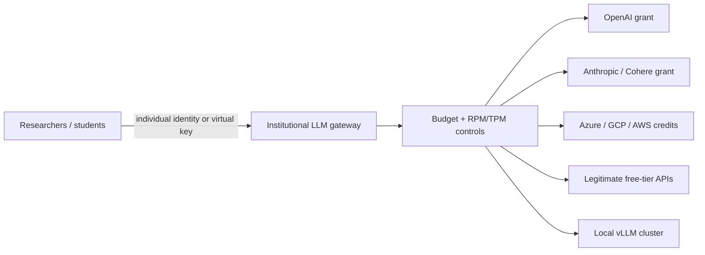
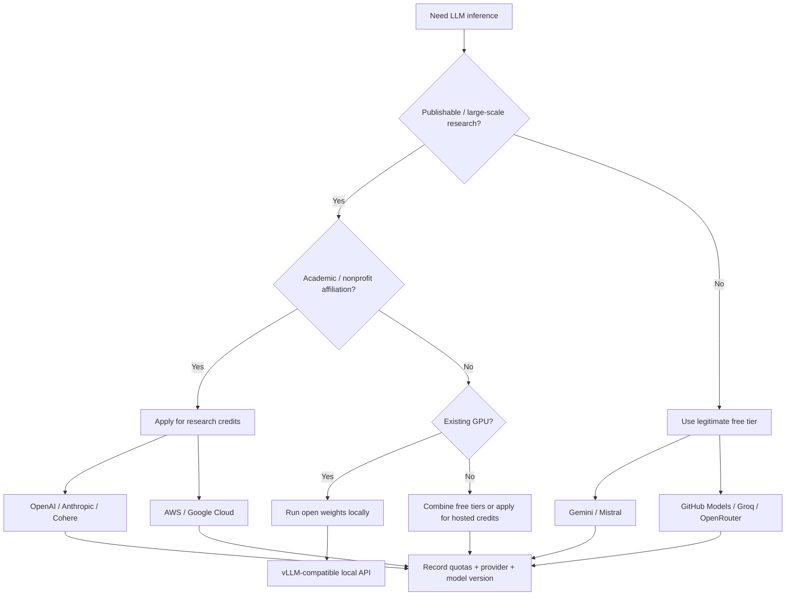

# Free-of-Charge Access to LLM APIs for Research, Study, and Learning

**Research snapshot: 30 September 2026.** This report distinguishes genuinely free access from promotional credits, temporary trials, cloud grants, institutional cost-sharing, and practices that merely shift or evade payment. “Legal risk” below primarily means contractual/Terms-of-Service risk; it is not a determination that a practice is unlawful under any particular jurisdiction.

## Executive summary

- **The best legitimate route for academic researchers is increasingly provider-funded research credits rather than “hacks.”** OpenAI currently offers eligible researchers up to **$1,000 of API credits for 12 months** through its Researcher Access Program; Anthropic's expanded AI for Science program offers selected projects **up to $50,000 in credits**; Cohere's rolling Catalyst Grants give non-commercial public-benefit/open-science projects free API credits. citeturn16search0turn16search8turn17search3turn16search2turn16search6

- **For students, Microsoft currently has the strongest explicit cloud-credit offer:** Azure for Students provides eligible full-time university students **$100 for 12 months**, no credit card required, and explicitly advertises access to technologies including Azure OpenAI. Students can renew annually while they remain eligible. citeturn18search2

- **Google provides a genuine zero-price Gemini API tier for several current models.** As of 30 September 2026, models including Gemini 3.8 Flash and 3.5 Flash-Lite have free-of-charge input/output quotas; exact availability and limits are model-dependent. Google also advertises **$5,000 research Cloud credits** and up to **$350,000 over two years** for qualifying AI startups. citeturn19search0turn18search0turn18search1

- **Mistral's current Free plan is unusually useful for individual experimentation:** it includes **$10/month of API credits** and access to Mistral Studio. Cohere also gives registered developers a free, rate-limited evaluation key, with its documented trial allowance capped at **1,000 API calls/month**. citeturn16search7turn10search3turn10search13

- **Several inference platforms offer meaningful legitimate free API access to open models.** GitHub Models gives every GitHub account rate-limited free access to its supported model catalog; Groq has a standing Free Plan, for example currently allowing gpt-oss-120b/20b at 30 requests/minute, 1,000 requests/day and 200,000 tokens/day; OpenRouter exposes designated `:free` models at 20 requests/minute and normally 50 free-model requests/day for accounts that have purchased less than $10 of credits. citeturn20search3turn20search0turn20search2

- **“Free trial” and “free tier” must not be conflated.** Cerebras currently gives a **$5 trial balance expiring after 30 days**, after which API access requires purchased credits; Hugging Face gives free users only **$0.10/month** of Inference Providers credits; Replicate's current official pricing is pay-as-you-go and does **not document a standing universal free inference tier**. citeturn20search1turn19search3turn22search0

- **The best institutional “trick” is a compliant gateway, not a shared API key.** A lab can keep provider credentials on a server and issue per-user virtual credentials through software such as LiteLLM, enforcing individual/team budgets and token/request limits. This is materially safer than emailing one API key to 50 students and also gives much better accounting. citeturn14search2turn14search6

- **Credential sharing, account pooling, trial cycling and consumer-UI wrappers are poor research infrastructure.** OpenAI prohibits circumventing rate limits/protective measures and advises individual API keys rather than shared keys; Mistral expressly prohibits buying, selling or transferring API keys and requires credentials to remain confidential; OpenRouter explicitly states that additional accounts/API keys do not increase its global rate limits. citeturn21search0turn6search1turn21search3turn21search7turn20search2

- **Local open-weight inference is often the only genuinely durable “free API.”** OpenAI's Apache-2.0 gpt-oss-20b can run in roughly **16 GB of memory**, while gpt-oss-120b fits in about **80 GB** because the released weights are natively MXFP4-quantized; vLLM can expose local models through an OpenAI-compatible HTTP API. The monetary API bill becomes zero, although hardware, electricity and administration obviously remain costs. citeturn22search3turn14search3

- **For publishable research, free access has a hidden reproducibility cost.** Quotas, endpoints and even available models can change: Cerebras, for example, removed Gemma 4 31B from its public endpoints on **3 September 2026** while retaining it on dedicated endpoints; Google, Colab and free inference providers similarly make free resources conditional on quotas/capacity. Experiments should therefore record exact model IDs, dates, endpoint/provider, parameters and—in open-model experiments—weight revisions. citeturn20search9turn12search2turn19search0

## Official programs and free tiers

The useful distinction is between four funding mechanisms: **research grants**, **student/education credits**, **startup credits**, and **standing developer free tiers**. They behave very differently in experiments: grants can support serious benchmarking, while most free tiers are suitable only for coursework, prototypes or small evaluation sets. citeturn16search0turn17search3turn18search2turn19search0

**Research, education and startup programs**

| Provider / program | Cost = free? | Eligibility and application | Limits / duration | Legal risk | Technical complexity | Primary sources |
|---|---|---|---|---|---|---|
| **OpenAI Researcher Access Program** | Yes, if awarded | Active affiliation with an academic institution/other research organization; nonprofits conducting research are also eligible. Submit research question and intended API use through the application portal. | Up to **$1,000 API credits**; **12 months**; usable on publicly available API models. Applications reviewed quarterly in March, June, September, December; grant delivery normally 4–6 weeks after the review. | Low | Low | citeturn16search0turn16search8 |
| **Anthropic AI for Science** | Yes, if awarded | The September 2026 general program says **any researcher may apply** for project credits. Separately, a PI/equivalent at an academic or nonprofit research institution can verify a laboratory for the scientists' team plan. | Up to **$50,000 in credits/project**. General program page does not give one universal credit lifetime; a specific 2026 rare-disease call gave up to $50k over six months. | Low | Low | citeturn17search3turn17search0 |
| **Anthropic Claude team plan for scientists** | Yes for standard seat | PI/equivalent at academic/nonprofit research institution verifies and adds lab members. | **10,000 initial seats**; standard seats free for **one year**; premium seats $15/month with 5× usage. This is primarily a Claude subscription program, not equivalent to unrestricted API credits. | Low | Low | citeturn17search3 |
| **Cohere Labs Catalyst Grants** | Yes, if awarded | Academic partners, civic/public-impact organizations; project should advance public benefit or open-science research and be non-commercial. Rolling application asks for affiliation, model choices, estimated calls, timeline and intended research artifact. | Award size varies; credits subject to API rate limits. Cohere reports 250 grants and $350k aggregate API credits awarded to date. | Low | Low | citeturn16search2turn16search6 |
| **Google Cloud research credits** | Yes, if awarded | Google Cloud's current researcher program has an application route for academic research. | Advertised grant: **$5,000 Google Cloud research credits**. The public landing page does not state one universal award duration or guarantee eligibility of every service, so verify the award terms for the particular project. | Low | Medium | citeturn18search0 |
| **AWS Cloud Credit for Research** | Yes, if awarded | Full-time faculty/research staff or graduate/postgraduate/PhD students at accredited research institutions; institutional email and AWS account required. Global except Greater China. Rolling review, normally 90–120 days. | Students: max **$5,000**; faculty/staff: no fixed program cap. Promotional credits last **one year or until exhausted**. Intended for finite research/cloud proof-of-concept, reusable tools or workshops rather than ongoing lab operations. | Low | Medium | citeturn19search1turn19search5 |
| **Azure for Students** | Yes | Full-time university students; academic verification; no credit card. | **$100 Azure credit for 12 months**, plus selected free services; can renew annually while eligible. Microsoft explicitly references Azure OpenAI among available technologies. | Low | Low–medium | citeturn18search2 |
| **Google Cloud AI startup program** | Yes, if accepted | VC-funded AI startup; founded within five years; specified pre-seed/seed/Series-A timing; generally not already >$5k Google Cloud credits; AI/Gemini central to product. | Up to **$350,000 over two years**: AI-first startups can receive up to $250k year one and 20% coverage up to another $100k year two. Covers Google models such as Gemini/Gemma, not third-party model charges. | Low | Medium | citeturn18search1 |
| **Microsoft for Startups** | Yes, if accepted/progressing | Privately held, for-profit software startup; pre-Series-C; Azure-supported country; other eligibility conditions apply. Direct application; partner-backed startups may unlock additional benefits. | Credits scale with progress/usage, **up to $150,000**. “Up to” is important: the maximum is not an automatic award to every applicant. | Low | Medium | citeturn18search3turn18search7 |
| **Azure for Startups entry offer** | Yes | New Azure customers; initial access, then business verification for larger amount. | **$1,000 immediately**, up to **$5,000 total**; initial credits 90 days, post-verification credits 180 days. | Low | Low–medium | citeturn18search2 |
| **AWS Activate** | Yes, if eligible | Startups; higher Portfolio tier requires affiliation with an Activate Provider and additional conditions. | Provider-backed startups can receive up to **$200,000** under the current program. Importantly, Activate credits can now pay for third-party foundation models on Amazon Bedrock, including models from Anthropic, Mistral, Meta and others. | Low | Medium | citeturn19search6turn19search2 |

A particularly useful 2026 development is **cloud-credit fungibility**. AWS announced in May 2026 that Activate credits can be spent on third-party Bedrock models. That means a startup does not necessarily need a direct Anthropic or Mistral grant to experiment with those models: eligible AWS promotional credits can fund them indirectly. citeturn19search2turn19search6

**Standing free access and trials**

| Provider / service | Cost = free? | Eligibility | Current limits / caveats | Legal risk | Technical complexity | Primary sources |
|---|---|---|---|---|---|---|
| **Google Gemini Developer API Free Tier** | **Yes** | Developer account; availability depends on model/region. | Several current models expose zero-price input/output on free tier. For example Gemini 3.8 Flash and 3.5 Flash-Lite are listed “free of charge.” Quotas are model-specific. | Low | Low | citeturn19search0 |
| **Mistral Free** | **Yes** | Standard free account | Current plan includes **$10/month API credits**, plus limited Studio/Vibe access. | Low | Low | citeturn16search7 |
| **Cohere evaluation/trial key** | **Yes** | Registered developer | Free evaluation access; documented trial allowance **1,000 API calls/month**, with endpoint/model rate limits. Intended for evaluation/proofs-of-concept, not production. | Low | Low | citeturn10search3turn10search13 |
| **GitHub Models** | **Yes** | Any GitHub account | All accounts get rate-limited free access to supported models; limits vary by model/Copilot plan and are aimed at prototyping/experimentation. | Low | Low | citeturn20search3 |
| **GroqCloud Free Plan** | **Yes** | Free Groq account | Example as of today: gpt-oss-120b/20b: **30 RPM, 1,000 requests/day, 8k TPM, 200k tokens/day**. Limits are organization-level. | Low | Low | citeturn20search0 |
| **OpenRouter `:free` models** | **Yes** | OpenRouter account | Designated free variants: **20 RPM** and normally **50 requests/day** for accounts with < $10 lifetime credit purchases. Higher 1,000/day ceiling requires prior credit purchase, so that tier is not strictly “zero expenditure.” | Low | Low | citeturn20search2 |
| **Cerebras Free Trial** | **Temporarily** | New/eligible account | **$5 credits, expiring after 30 days**. gpt-oss-120b currently 5 RPM, 30k uncached TPM and 1M tokens/day. There is explicitly **no automatically renewing no-cost tier**. | Low | Low | citeturn20search1turn20search5 |
| **Hugging Face Inference Providers** | Technically yes, but tiny | Any free HF user | **$0.10/month** of credits, explicitly subject to change. Useful for smoke tests, not substantive LLM experiments. | Low | Low | citeturn19search3 |
| **Hugging Face ZeroGPU Spaces** | **Yes**, quota-limited | Any user to consume; free account in good standing, verified email and >30 days old to host | Free account receives **5 GPU-minutes/day** and can host up to **two ZeroGPU Spaces**; unauthenticated usage is 2 min/day. | Low | Medium | citeturn14search1 |
| **Replicate** | **No standing free tier verified** | — | Current official pricing says pay only for usage, with public models charged by time or tokens/output. I found no current official universal free inference quota. Promotional credits may exist case-by-case, but should not be treated as a durable program. | Low | Low | citeturn22search0 |
| **Aleph Alpha / PhariaAI** | **No public free program verified** | Enterprise/deployment access appears to be the current focus | Current documentation exposes authenticated PhariaInference APIs and token management, but I could not verify a current public student/research free-credit scheme from Aleph Alpha's official 2026 material. **Uncertain negative finding:** a private partnership program may exist. | Low | Medium | citeturn22search1turn22search5 |

Two corrections to common online advice are therefore important. **Replicate should not currently be presented as having a general free tier**, and **Hugging Face's ordinary Inference Providers allowance is only ten cents per month for free users**; HF's materially more useful free compute mechanism is ZeroGPU rather than the hosted inference credit. citeturn22search0turn19search3turn14search1

## Community and institutional workarounds

There is a sharp distinction between a **workaround that improves allocation of legitimate credits** and a workaround that **evades the provider's charging or access controls**.

| Technique | Cost = free? | Eligibility | Practical implementation | Limits | Legal / ToS risk | Technical complexity | Primary sources |
|---|---|---|---|---|---|---|---|
| **Institutional LLM gateway** | End users can be free; institution/grant pays | Lab/course/institution with legitimate provider account | Store upstream keys only on the gateway; authenticate every researcher/student separately; issue virtual keys; enforce per-user/team budgets, TPM and RPM. LiteLLM directly supports these controls. | Overall upstream quota/budget still applies. | **Low**, when provider contract permits the institutional application/end users | Medium | citeturn14search2turn14search6 |
| **Cloud-credit → managed-model API** | Yes until credits expire | Grant/student/startup eligibility | Obtain AWS/Azure/GCP credits, create the managed-model resource under the credited cloud account, and expose it through normal cloud IAM or a lab gateway. | Grant duration and eligible services. | **Low** | Medium | citeturn19search1turn19search2turn18search2turn18search0 |
| **Organization billing with individual identities** | Depends on sponsor | Team/institution | Give each user their own identity/token while centralizing billing. HF, for example, supports organization billing while every user retains an individual access token. | Subscription/credit pool. | **Low** | Low–medium | citeturn19search3 |
| **Sponsored academic partnership** | Often | Requires successful proposal/relationship | Apply to OpenAI, Anthropic, Cohere, AWS, Google or a university/cloud program; place awarded credits in an institutional project. | Selective; proposal-specific. | **Low** | Low administratively, medium organizationally | citeturn16search0turn17search3turn16search6turn19search1turn18search0 |
| **Free API aggregators / legitimate free endpoints** | Yes within quotas | Usually account registration | Use documented endpoints such as GitHub Models, Groq or OpenRouter's explicitly free model IDs. | Low daily/token ceilings and no SLA. | **Low** if used normally | Low | citeturn20search3turn20search0turn20search2 |
| **One shared lab API key passed among users** | Cost may be centrally funded, not actually free | Anyone receiving the credential | Technically trivial, but replace it with a gateway or provider organization/project accounts. | Poor attribution; one leak compromises whole budget. | **Medium–high**; provider rules often restrict credential sharing | Low | citeturn6search1turn21search7 |
| **Account/password sharing** | Superficially | Shared login | Do not use as the access-control mechanism; provision supported end-user accounts instead. | MFA, audit and concurrent-use problems. | **High** where terms expressly prohibit shared credentials | Low | citeturn8view1turn21search7 |
| **API-key/token marketplace or exchanging tokens with strangers** | Sometimes | Access to somebody else's credential | No legitimate engineering reason in a research environment; use BYOK with one's own credentials or an authorized gateway instead. | Revocation, fraud, uncontrolled billing. | **High**; Mistral explicitly prohibits buying, selling or transferring API keys/accounts. | Low | citeturn21search3 |
| **Cycling trial accounts / multi-account quota evasion** | Superficially | Ability to create identities/accounts | Not a sustainable access strategy. Use multiple providers or free models legitimately instead. | Detection/account suspension; poor reproducibility. | **High** | Low | citeturn21search0turn20search2 |
| **Reverse-engineered API around consumer chat UI** | Superficially | Consumer subscription/free UI | A wrapper automates a web UI/session rather than the documented developer API. I do not recommend implementation instructions because the central mechanism can itself violate automation/extraction restrictions. | UI changes, CAPTCHAs, account controls; no API guarantees. | **High** for providers whose terms prohibit automated extraction or protective-measure bypass | Medium–high | citeturn21search0turn8view1 |
| **VPN/geographic/account-control circumvention** | Superficially | — | Not a legitimate research-access mechanism. | Account termination and compliance problems. | **High** when used to bypass eligibility/access restrictions | Low | citeturn21search0turn21search3 |
| **Community-hosted proxy using somebody else's upstream credits** | Possibly | Proxy operator permits access | Technically just an intermediary HTTP gateway. Only use where the operator explicitly offers the service and upstream terms permit it. | Availability, privacy, provenance and quota unknown. | **Variable / often unclear** | Low client-side | citeturn14search2 |

The practical institutional pattern is:

LiteLLM's current gateway supports per-user, per-team and per-key budgets as well as TPM/RPM limits; vLLM can make a locally hosted model look like an OpenAI-compatible endpoint. Those two properties make this architecture convenient for courses and labs because application code can remain largely provider-neutral. citeturn14search2turn14search6turn14search3

A minimal compliant implementation is therefore:

1. Create the upstream API/cloud accounts under the institution rather than an individual student.
2. Put upstream secrets only on the gateway host or secret manager.
3. Run a gateway such as LiteLLM and expose only its virtual keys to users.
4. Give every user or project a separate virtual key and assign a hard monetary, TPM and RPM budget.
5. Maintain an allow-list of models for the course/project.
6. Record upstream provider and model ID with each experimental run, while avoiding prompt logging when the research data requires stronger confidentiality. LiteLLM provides the budget/rate-control primitives required for this design. citeturn14search2turn14search6

This is better than a shared credential even where sharing inside an organization is technically possible: attribution, revocation and budget isolation become local administrative operations rather than reasons to rotate the entire lab's upstream secret.

## Technical alternatives

The most robust way to obtain a zero-dollar **API bill** is to stop depending on a proprietary API. It does not make computation economically free, but it changes the scarce resource from metered tokens to hardware time.

| Provider / technique | Cost = free? | Eligibility | Limits / trade-off | Legal risk | Technical complexity | Primary sources |
|---|---|---|---|---|---|---|
| **gpt-oss-20b locally** | API: yes; compute: no | Anyone under model license | Apache 2.0; natively MXFP4; about **16 GB memory**; 128k context. Good laptop/workstation-class research target where supported hardware is available. | Low | Medium | citeturn22search3 |
| **gpt-oss-120b locally** | API: yes; compute: no | Anyone under model license | Apache 2.0; about **80 GB memory**; 128k context; practical on one 80-GB accelerator according to OpenAI. | Low | Medium–high | citeturn22search3 |
| **Mistral open-weight models** | API: yes when self-hosted | License-dependent | Mistral has continued releasing Apache-2.0 open models; recent Small 4 is a 119B-total/6B-active MoE with 256k context, but full-weight storage still makes deployment substantially heavier than its active-parameter count suggests. | Low under applicable open license | Medium–high | citeturn13search7 |
| **Gemma 4 family** | API: yes when self-hosted | License/model-card conditions | Current family provides multiple sizes for local/server deployment and is designed for multilingual/multimodal use. Hardware requirement varies greatly by size/quantization. | Low if license conditions followed | Medium | citeturn13search2 |
| **DeepSeek-R1 distills** | API: yes when self-hosted | Base-model and derivative-license conditions apply | 1.5B–70B distilled checkpoints provide much smaller reasoning models. DeepSeek's model card permits modifications/distillation but also documents the Qwen/Llama base models from which specific distills derive. | Low–medium; check the specific base license | Medium | citeturn15search2turn15search6 |
| **vLLM OpenAI-compatible server** | Software yes | Local/cloud hardware | Exposes `/v1`-style completion/chat APIs; supports several quantized load formats and parallel deployment. | Low | Medium | citeturn14search3 |
| **GPTQ quantization** | Software/research method yes | Compatible weights/runtime | 3–4-bit post-training weight quantization can dramatically cut memory; the GPTQ paper reports negligible degradation on its tested models and substantial inference speedups, but those results must not be generalized blindly to every architecture/task. | Depends on model license | Medium–high | citeturn15search1 |
| **AWQ quantization** | Software/research method yes | Compatible weights/runtime | Activation-aware low-bit quantization; the MLSys work reports roughly **4× model-size reduction** at INT4 with small degradation in evaluated settings and implements optimized 4-bit inference. | Depends on model license | Medium–high | citeturn15search0turn15search4 |
| **Knowledge distillation** | Method yes; teacher inference may cost money | Teacher/output terms must permit intended use | Can transfer capabilities from a larger teacher to a smaller deployable student. It is an optimization technique, **not a license bypass**. | Potentially high with prohibited teacher-output use | High | citeturn15search3turn21search0 |
| **Google Colab free runtime** | Yes | Google account / service availability | Free notebooks can expose GPUs/TPUs, but resources, accelerator type and limits are not guaranteed and may fluctuate. Free-tier anti-abuse rules restrict techniques such as using the notebook as a generic remote desktop/SSH service. | Low for normal notebook use | Low–medium | citeturn12search2 |
| **Hugging Face ZeroGPU** | Yes within daily quota | HF users; stricter condition to host | Free users: 5 GPU-min/day; eligible free accounts can host two ZeroGPU Spaces. Excellent for demos or interactive teaching, poor for sustained benchmark campaigns. | Low | Medium | citeturn14search1 |
| **GitHub Models** | Yes within quota | GitHub account | Convenient API playground for comparing multiple hosted models; not intended as unlimited production inference. | Low | Low | citeturn20search3 |
| **Groq free inference** | Yes within quota | Groq account | Fast hosted access to a limited catalog; gpt-oss free-plan limits currently allow meaningful experimentation but not large-scale evaluation. | Low | Low | citeturn20search0 |
| **Cerebras Free Trial** | Only temporarily | New/eligible account | Very fast hosted inference but $5/30-day trial rather than permanent zero-cost compute. | Low | Low | citeturn20search1turn20search5 |
| **Replicate** | No generic free allocation verified | Normal account | Excellent managed serving convenience, but current public documentation is pay-as-you-go. | Low | Low | citeturn22search0 |

### Quantization is usually the highest-leverage local-inference trick

For weight storage alone, changing a 16-bit representation to 4 bits gives an **idealized 4× reduction**. Real runtime memory also contains KV cache, activations, runtime buffers and sometimes higher-precision tensors, so total VRAM does not fall by exactly 4×. GPTQ and AWQ provide empirical evidence that well-designed 3–4-bit post-training quantization can retain much of the original model's quality, although the size/accuracy/speed result is model-, task-, hardware- and kernel-dependent. citeturn15search1turn15search0

A useful hierarchy for research engineering is therefore:

| Need | First choice | Why |
|---|---|---|
| A few hundred exploratory calls | Gemini Free, Mistral Free, Groq, GitHub Models, OpenRouter free models | Almost zero setup; sufficient for prototyping. citeturn19search0turn16search7turn20search0turn20search3turn20search2 |
| Thousands/millions of publishable calls | Research grant/cloud credits | Stable billing account and larger allocation are preferable to stitching together free tiers. citeturn16search0turn17search3turn19search1 |
| Sensitive data | Local open model or contracted API with appropriate data terms | Avoids sending data through unknown public proxies; OpenAI's API business data is not used for training by default. citeturn14search0turn14search8 |
| Repeated course every semester | Department gateway + local model + one or more free hosted fallbacks | Central quotas, no shared upstream secrets, and less dependence on a single provider's free-tier policy. citeturn14search2turn14search3 |
| Reproducible systems research | Pinned open weights locally | Removes endpoint retirement and silent hosted-model replacement from the main experimental variable. Recent Cerebras endpoint removals illustrate the issue. citeturn20search9 |

### Distillation has a licensing trap

Distillation itself is a standard compression/knowledge-transfer technique. Hinton, Vinyals and Dean formalized the now-standard teacher/student approach, and DeepSeek explicitly used R1-generated samples to construct smaller R1 distills. citeturn15search3turn15search2

But the technical ability to collect outputs does **not** imply permission to use them as model-training data. OpenAI's current Terms of Use prohibit using output to develop models that compete with OpenAI; therefore, a workflow of “use a free proprietary API to generate millions of examples, then train my own substitute model” can be precisely the kind of activity the terms restrict. citeturn21search0

Conversely, DeepSeek's R1 model card expressly says its released code/weights support modification and derivative works including distillation, while warning that particular R1 distills inherit ancestry from Qwen or Llama models whose applicable terms must also be considered. citeturn15search2turn15search6

Thus **distillation is a cost-reduction strategy only after the teacher's terms and the student's base-model license have been checked**.

## Ethical, legal and security risks

The highest-risk “free access” techniques are generally not sophisticated technical exploits. They are ordinary engineering shortcuts—shared credentials, unidentified proxies, uncontrolled logging and experimental dependence on ephemeral quotas.

| Risk | What can go wrong | Severity for research | Evidence / policy |
|---|---|---:|---|
| **Rate-limit / trial circumvention** | Account suspension, termination, inability to reproduce the work under the same access conditions. | High | OpenAI explicitly prohibits circumventing rate limits/restrictions/protective measures; OpenRouter explicitly says extra accounts/API keys do not increase its global limits. citeturn21search0turn20search2 |
| **Shared or traded credentials** | Accidental expenditure, loss of attribution, compromise of all users, policy breach. | High | OpenAI recommends unique team-member keys; Mistral prohibits key/account transfers and requires credentials to remain confidential. citeturn6search1turn21search3turn21search7 |
| **Automating consumer web interfaces** | Breakage when UI changes; possible automation/extraction or protective-control violation. | High | OpenAI prohibits programmatic extraction and protection bypass; Anthropic's consumer terms restrict automated access except through authorized mechanisms. citeturn21search0turn8view1 |
| **Sending research data to free services** | Prompts may be retained/used under different conditions from paid enterprise APIs. | High for confidential/human-subject data | Google specifically distinguishes unpaid and paid Gemini services, with an important EEA/CH/UK exception described below. citeturn21search2 |
| **Unknown third-party proxy** | Proxy operator can potentially observe prompts, outputs and credentials and may itself be violating upstream terms. | High | This follows architecturally whenever a proxy terminates/authenticates the HTTP request; legitimate gateways such as LiteLLM should therefore be operated by a trusted party. citeturn14search2 |
| **Model/provider drift** | Results change or endpoint disappears between experiment and replication. | High for publications | Cerebras removed Gemma 4 31B from public endpoints on 3 September 2026; Colab explicitly states resources/limits fluctuate. citeturn20search9turn12search2 |
| **“Free” quotas silently turning into spend** | Accidental charges once free allocation is exhausted. | Medium–high | HF distinguishes included credits from pay-as-you-go; Azure distinguishes promotional credits from post-credit paid operation. citeturn19search3turn18search2 |
| **Free-tier availability bias** | Research compares models because they were inexpensive rather than because they are scientifically appropriate. | Medium | This is a methodological inference from the highly heterogeneous free quotas documented by providers. citeturn19search0turn20search0turn20search1 |
| **Unlicensed teacher-output distillation** | A student model may violate provider contractual restrictions even if training code and resulting weights are technically original. | High | OpenAI currently prohibits using output to develop competing models. citeturn21search0 |

### The Gemini privacy rule has an important European exception

Google's March 23, 2026 Gemini API terms say that for ordinary **Unpaid Services**, Google may use submitted content and generated responses to provide, improve and develop its products, and may have human reviewers process data; Google consequently says not to submit sensitive, confidential or personal information to those unpaid services. citeturn21search2

However, the same current terms make an important geographical carve-out: **for users in the European Economic Area, Switzerland and the United Kingdom, the “Paid Services” data-handling provisions apply to all Gemini services, including AI Studio and free API quota**. Under the Paid Services provision, Google says prompts and responses are not used to improve its products. This makes older blanket statements that “Google trains on all free Gemini API traffic” inaccurate for European users as of September 2026. citeturn21search2

OpenAI likewise states that data sent through its API Platform is **not used to train its models by default**, unless the customer explicitly opts in to data sharing. Qualifying API customers can also obtain stronger retention controls, including zero-data-retention configurations. citeturn14search0turn14search8

The correct research practice is therefore to record **not only the model and provider but also the service tier, account geography and data-processing terms that applied at experiment time**.

### Reproducibility is an underrated cost of “free”

A result reported simply as “we evaluated Gemma 4 using a free API” may become unreproducible within weeks. On 3 September 2026, for example, Cerebras removed `gemma-4-31b` from its public endpoints while keeping it available on dedicated endpoints and recommending a different public model. citeturn20search9

For an API-based experiment, the artifact should therefore record at least:

- exact provider and endpoint;
- exact model ID/version, not merely the family name;
- experiment date;
- system/developer prompt;
- decoding parameters and seed where meaningful;
- number of calls and retry policy;
- whether requests were routed through an aggregator;
- service/free-tier type and any provider-side features such as search or caching;
- for local inference, exact weight commit/revision, quantization, inference engine and engine version.

These fields are a methodological recommendation motivated by the documented volatility of hosted models and free resources, rather than a provider requirement. citeturn20search9turn12search2

## Practical checklist

The safest decision process is to treat “free access” as a resource-allocation problem rather than an account-creation problem.

Before using any route, answer these questions:

| Check | Decision criterion | Preferred action |
|---|---|---|
| **Is there an official research/student grant?** | Research affiliation, course enrollment or startup eligibility | Apply before looking for workarounds. OpenAI, Anthropic, Cohere, AWS, Google and Microsoft all currently provide relevant routes. citeturn16search8turn17search3turn16search6turn19search1turn18search0turn18search2 |
| **Is the “free” offer permanent or promotional?** | Renewable free tier versus expiring credit | Treat Cerebras, for example, as a 30-day/$5 trial; treat Groq/Gemini/Mistral as current recurring/free-plan offerings subject to future policy changes. citeturn20search1turn20search0turn19search0turn16search7 |
| **What is the actual quota?** | Calls/day, tokens/day, RPM/TPM, concurrent requests | Calculate benchmark feasibility before implementing against a provider. citeturn20search0turn20search1turn20search2 |
| **Can the provider use my inputs/outputs?** | Sensitive, unpublished, proprietary or human-subject data | Read the tier-specific data terms. In particular, Gemini's free-tier rules differ geographically, while OpenAI API data is not used for training by default. citeturn21search2turn14search0 |
| **Am I sharing a credential?** | More than one person possesses the same raw upstream secret | Replace shared keys with individual provider identities or an institutional gateway with virtual keys. citeturn6search1turn14search6 |
| **Does the approach defeat a quota or eligibility rule?** | Multiple accounts, token rotation, UI automation, VPN restriction bypass | Do not make it part of the research methodology; choose another provider or local model. citeturn21search0turn20search2 |
| **Could I run an open model instead?** | Evaluation does not specifically require a proprietary frontier model | gpt-oss-20b is a particularly convenient current baseline because its 4-bit weights require about 16 GB memory and are Apache 2.0. citeturn22search3 |
| **Does quantization preserve the metric I care about?** | Task-sensitive evaluation | Re-evaluate after quantization rather than assuming published GPTQ/AWQ results generalize. citeturn15search0turn15search1 |
| **Am I distilling from API outputs?** | Outputs become student-model training data | Explicitly verify output/training restrictions first. citeturn21search0turn15search2 |
| **Can another researcher reproduce the endpoint later?** | Publication or benchmark | Pin open weights where possible; otherwise log provider, exact model/version, date and decoding setup. citeturn20search9 |
| **What happens when the free allocation ends?** | Long-running project/course | Put a hard budget at gateway/provider level and maintain a local/open fallback. LiteLLM supports user/team/key budgets and rate limits. citeturn14search2turn14search6 |

A simple hierarchy works well in practice:

**official research grant → student/cloud credit → documented recurring free API → institutional sponsored gateway → local open-weight inference → temporary trials**.

Shared credentials, trial-account cycling and unofficial consumer-web wrappers should sit outside that hierarchy because they do not produce stable, auditable research infrastructure. citeturn21search0turn21search7turn20search2

## Case studies

| Scenario | Recommended safe path | Concrete choices | Why |
|---|---|---|---|
| **University research lab** | Apply for research credits; aggregate them behind a lab gateway; maintain an open-model cluster for bulk runs. | **OpenAI Researcher Access:** up to $1k/12 months. **Anthropic AI for Science:** up to $50k/project where research fits. **Cohere Catalyst:** free credits for open-science/public-benefit projects. **AWS Research:** up to $5k for students, uncapped program maximum for faculty/staff awards. Deploy LiteLLM in front; use local gpt-oss through vLLM for high-volume baseline experiments. | Maximizes available compute while retaining per-researcher accounting and avoiding shared credentials. It also separates expensive frontier-model evaluations from bulk experiments that can run locally. citeturn16search0turn17search3turn16search6turn19search1turn14search2turn22search3 |
| **Independent researcher without institutional affiliation** | Start with legitimate recurring free APIs and local open weights; apply to provider programs that do not require conventional university affiliation where appropriate. | **Gemini API Free Tier**, **Mistral $10/month API credits**, **GitHub Models**, **Groq Free**, **OpenRouter `:free`**, plus gpt-oss-20b locally. Anthropic's current AI for Science announcement says any researcher may apply for project credits, although selection is not guaranteed. | OpenAI's Researcher Access eligibility currently requires active affiliation with an academic/research organization or eligible nonprofit, making it less suitable for a genuinely unaffiliated individual. Anthropic's general AI for Science language is broader. citeturn19search0turn16search7turn20search3turn20search0turn20search2turn22search3turn16search8turn17search3 |
| **Master's-level university course** | Give students individual free accounts where pedagogically useful and provide a department gateway/local endpoint for uniform assignments. | **GitHub Models** for easy multi-model prototyping; **Azure for Students** gives eligible students $100/12 months; **Gemini Free** and **Mistral Free** provide direct APIs; **Groq Free** provides gpt-oss. For assessed coursework, expose one department-managed vLLM/gpt-oss endpoint so every student has the same baseline. | Individual accounts eliminate secret sharing; the common local endpoint gives equal access and reproducibility even if individual free-tier quotas differ or providers change terms mid-semester. citeturn20search3turn18search2turn19search0turn16search7turn20search0turn14search3turn22search3 |

For a Computer Science course, the last architecture is particularly robust: students can learn **real commercial API integration** against GitHub/Gemini/Mistral/Groq while all graded experiments also target a department-controlled OpenAI-compatible endpoint. Application code can therefore switch only `base_url`, model ID and credential rather than being rewritten for every provider. vLLM explicitly implements an OpenAI-compatible HTTP server, and LiteLLM can provide the corresponding multi-provider gateway abstraction. citeturn14search3turn14search2

## Consolidated references

| Source | Relevance |
|---|---|
| **OpenAI — Researcher Access Program application** citeturn16search0 | Current program; up to $1,000, 12-month validity, quarterly review. |
| **OpenAI — Researcher Access Program FAQ** citeturn16search8 | Eligibility, grant timing, expiry and rate-limit/payment-method details. |
| **OpenAI — Terms of Use** citeturn21search0 | Rate-limit/protection circumvention, automated extraction and competitive-model restrictions. |
| **OpenAI — Enterprise Privacy** citeturn14search0 | API/business data not used for training by default. |
| **OpenAI — Business data privacy, security and compliance** citeturn14search8 | API training policy and retention controls. |
| **OpenAI — Introducing gpt-oss** citeturn22search3 | Apache 2.0 gpt-oss-120b/20b, MXFP4, memory requirements, model architecture. |
| **Anthropic — Expanding our support for scientists, 27 Aug 2026** citeturn17search3 | 10,000 scientist seats, one-year access, expanded AI for Science, up to $50k/project. |
| **Anthropic — AI for Science rare-disease grants** citeturn17search0 | Example of $50k/six-month targeted research grant. |
| **Cohere Labs — Catalyst Grants** citeturn16search2 | Current rolling public-benefit/open-science grant program. |
| **Cohere Labs — Catalyst Grant application** citeturn16search6 | Application fields and explicit free API-credit mechanism. |
| **Google — Gemini Developer API pricing** citeturn19search0 | Current zero-price Gemini API tiers and model-dependent pricing. |
| **Google — Gemini API Additional Terms, effective 23 Mar 2026** citeturn21search2 | Free/paid data rules and EEA/Switzerland/UK exception. |
| **Google Cloud — Cloud for Researchers** citeturn18search0 | Current $5,000 research-credit application. |
| **Google Cloud — AI startup program** citeturn18search1 | Up to $350k credits/2 years and eligibility criteria. |
| **Microsoft Azure — Azure for Students** citeturn18search2 | $100/12 months, full-time-student conditions and Azure OpenAI reference. |
| **Microsoft — Microsoft for Startups** citeturn18search3turn18search7 | Startup eligibility and up to $150k credits. |
| **AWS — Cloud Credit for Research** citeturn19search1turn19search5 | Eligibility, $5k student cap, one-year credit lifetime and global scope. |
| **AWS — Activate credits for third-party Bedrock models** citeturn19search2 | Credits usable for third-party foundation models on Bedrock. |
| **AWS — Activate Credits guide** citeturn19search6 | Startup tiers and current maximum credits. |
| **Mistral — Pricing** citeturn16search7 | Current Free plan and $10/month API credits. |
| **Mistral — Commercial Terms of Service** citeturn21search3 | API-key transfer, security circumvention and account-use restrictions. |
| **Mistral — Additional Product Terms** citeturn21search7 | Credential confidentiality and end-user-account rules. |
| **Hugging Face — Inference Providers pricing** citeturn19search3 | $0.10/month free-user credits and organization billing. |
| **Hugging Face — ZeroGPU documentation** citeturn14search1 | Daily free GPU quota and free Space-hosting limits. |
| **Replicate — Pricing** citeturn22search0 | Current pay-as-you-go model; basis for the finding that no standing universal free tier is documented. |
| **Aleph Alpha — PhariaAI Developer Guide / API** citeturn22search1turn22search5 | Current API/deployment documentation; no current public free-credit program was verifiable from these materials. |
| **GitHub — GitHub Models billing** citeturn20search3 | Free rate-limited model access for all GitHub accounts. |
| **Groq — Free Plan rate limits** citeturn20search0 | Current per-model free limits, including gpt-oss. |
| **Cerebras — Inference rate limits** citeturn20search1 | $5/30-day trial and current free-trial quotas. |
| **Cerebras — Inference change log** citeturn20search9 | Concrete 2026 endpoint/model changes illustrating reproducibility risk. |
| **OpenRouter — API credit and rate limits** citeturn20search2 | `:free` limits and explicit statement that additional accounts/keys do not expand quotas. |
| **Google — Colab FAQ** citeturn12search2 | Free GPU/TPU availability, fluctuating limits and anti-abuse restrictions. |
| **LiteLLM — budgets and rate limits** citeturn14search2 | Per-user/team/key budget and quota management for institutional gateways. |
| **LiteLLM — virtual keys** citeturn14search6 | Virtual credentials and budget/rate-control mechanisms. |
| **vLLM — OpenAI-compatible server documentation** citeturn14search3 | Local OpenAI-compatible serving and supported quantization/load formats. |
| **Frantar et al. — GPTQ: Accurate Post-Training Quantization for Generative Pre-trained Transformers** citeturn15search1 | Primary paper on practical 3–4-bit post-training LLM quantization. |
| **Lin et al. — AWQ: Activation-aware Weight Quantization for LLM Compression and Acceleration, MLSys 2024** citeturn15search0turn15search4 | Low-bit weight quantization, compression and empirical accuracy results. |
| **Hinton, Vinyals & Dean — Distilling the Knowledge in a Neural Network** citeturn15search3 | Foundational knowledge-distillation reference. |
| **DeepSeek — R1 Distill model card** citeturn15search2turn15search6 | Distillation procedure, released checkpoint sizes and derivative/base-license notes. |

**Uncertain or volatile findings.** Free-tier quotas and promotional programs are especially volatile. The table values above are the values verifiable from official sources on **30 September 2026**. In particular, I found no current official universal free tier for Replicate and no current public free-credit program for Aleph Alpha; those are **negative search findings rather than proof that private, partner-specific or newly launched offers do not exist**. Replicate's current official documentation describes metered pay-as-you-go service, while Aleph Alpha's current documentation emphasizes authenticated PhariaAI deployment/API access. citeturn22search0turn22search1turn22search5